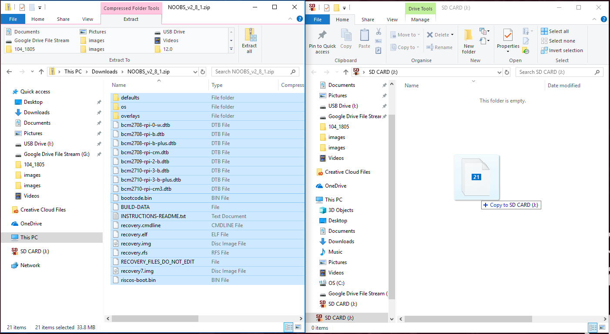

## قم بإعداد بطاقة SD الخاصة بك

إذا كان لديك بطاقة SD لا تحتوي على نظام التشغيل Raspbian بعد ، أو إذا كنت ترغب في إعادة ضبط Raspberry Pi ، فيمكنك بسهولة تثبيت Raspbian بنفسك. للقيام بذلك ، تحتاج إلى جهاز كمبيوتر يحتوي على منفذ بطاقة SD - معظم أجهزة الكمبيوتر المحمولة وأجهزة سطح المكتب لديها واحد.

### نظام التشغيل Raspbian عبر NOOBS

يعد استخدام برنامج NOOBS أسهل طريقة لتثبيت برنامج Raspbian على بطاقة SD الخاصة بك.

#### تنزيل NOOBS

+ تفضل بزيارة صفحة [Raspberry Pi downloads](https://www.raspberrypi.org/downloads).

+ سترى مربعًا يربط ملفات NOOBS. انقر فوق المربع.

+ الخيار الأبسط هو تنزيل أرشيف الملفات بتنسيق zip. تأكد من المكان الذي تحفظ فيه الأرشيف ، بحيث يمكنك العثور عليه مرة أخرى بسرعة.

#### تهيئة بطاقة الـ SD

سيتم استبدال أي شيء تم تخزينه على بطاقة الـ SD أثناء عملية مسح الذاكرة. لذا إذا كانت بطاقة SD التي تريد تثبيت Raspbian عليها حاليًا أي ملفات عليها ، على سبيل المثال من إصدار قديم من Raspbian ، قد ترغب في إعادة هذه الملفات أولاً إلى عدم فقدها نهائيًا.

+ قم بزيارة موقع ويب SD Association وقم بتنزيل [SD Formatter 4.0](https://www.sdcard.org/downloads/formatter_4/index.html) لنظام Windows أو Mac.

+ اتبع التعليمات لتثبيت البرنامج.

+ أدخل بطاقة SD في فتحة بطاقة SD الخاصة بجهاز الكمبيوتر المحمول أو الكمبيوتر المحمول وقم بتدوين حرف محرك الأقراص المخصص له ، على سبيل المثال `F: /`.

+ في SD Formatter ، حدد حرف محرك الأقراص لبطاقة SD الخاصة بك ، وتنسيق البطاقة.

#### استخرج NOOBS من الأرشيف المضغوط

بعد ذلك ، ستحتاج إلى استخراج الملفات من أرشيف NOOBS المضغوط الذي قمت بتنزيله من موقع Raspberry Pi على الويب.

+ ابحث عن الأرشيف الذي تم تنزيله - بشكل افتراضي ، يجب أن يكون في المجلد `Downloads` الخاص بك.

+ انقر نقرًا مزدوجًا فوقها لاستخراج الملفات والاحتفاظ بالنوافذ الناتجة عن Explorer / Finder المفتوحة.

#### انسخ الملفات

+ الآن افتح نافذة مستكشف / مستكشف أخرى وانتقل إلى بطاقة SD. من الأفضل وضع النافذة جنبًا إلى جنب.

+ حدد جميع الملفات الموجودة في المجلد `NOOBS` واسحبها إلى نافذة بطاقة SD لنسخها إلى البطاقة.

+ بمجرد نسخ جميع الملفات ، يمكنك إخراج بطاقة SD.