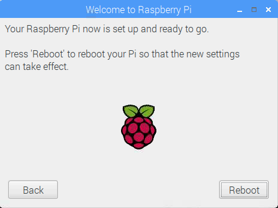

## الانتهاء من الإعداد

عند بدء تشغيل جهاز Raspberry Pi لأول مرة، فستظهر رساله **مرحبا بكم في Raspberry Pi** على السطح وتوجهك من خلال الإعداد الأولي.

+ انقر فوق **التالي** لبدء الإعداد.

+ تعيين **البلد** و **اللغة** و **المنطقة الزمنية** الخاصة بك، ثم انقر فوق **التالي** مرة أخرى.

+ أدخل كلمة مرور جديدة لـ Raspberry Pi وانقر فوق **التالي**.

+ اتصل بشبكة WiFi عن طريق تحديد اسمها وإدخال كلمة المرور والنقر على **التالي**.

**ملاحظة:** إذا كان طراز Raspberry Pi لا يحتوي على اتصال لاسلكي ، فلن ترى هذه الشاشة.

+ انقر فوق **التالي** دع المعالج يبحث عن تحديثات لـ Raspbian وقم بتثبيتها (قد يستغرق هذا بعض الوقت).

+ انقر فوق **Done** أو **Reboot** لإنهاء الإعداد.

**ملاحظة:** ستحتاج فقط إلى إعادة التشغيل إذا كان ذلك ضروريًا لإكمال التحديث.

