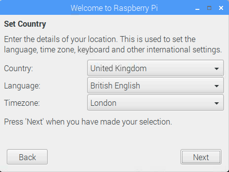

## الانتهاء من الإعداد

عند بدء تشغيل جهاز التوت بي لأول مرة، و **مرحبا بكم في التوت بي** وتطبيق يطفو على السطح وتوجه لكم من خلال الإعداد الأولي.

+ انقر فوق **التالي** لبدء الإعداد.

+ اضبط **بلد**و **لغة**و **المنطقة الزمنية**، ثم انقر فوق **التالي** مرة أخرى.

+ أدخل كلمة مرور جديدة لـ Raspberry Pi وانقر فوق **Next**.

+ اتصل بشبكة WiFi عن طريق تحديد اسمها وإدخال كلمة المرور والنقر على **التالي**.

**ملاحظة:** إذا كان طراز Raspberry Pi لا يحتوي على اتصال لاسلكي ، فلن ترى هذه الشاشة.

+ انقر فوق **التالي** دع المعالج يبحث عن تحديثات لـ Raspbian وقم بتثبيتها (قد يستغرق هذا بعض الوقت).

+ انقر فوق **Done** أو **Reboot** لإنهاء الإعداد.

**ملاحظة:** ستحتاج فقط إلى إعادة التشغيل إذا كان ذلك ضروريًا لإكمال تحديث.

