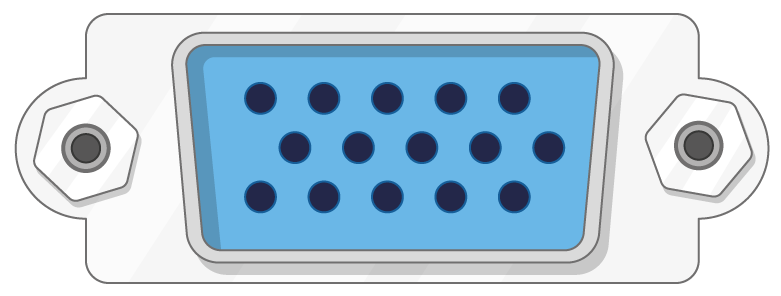

## Beth fydd ei angen arnoch chi

### Pa Pi Mafon?

Mae yna nifer o [fodelau o Mws Pi](https://www.raspberrypi.org/products/), ac i'r rhan fwyaf o bobl, y Mwg Mws 3 Model B + yw'r un i'w ddewis.

Y Mwg Mafon 3 Model B + yw'r mwyaf diweddar, cyflymaf a hawsaf i'w ddefnyddio.

Mae'r Môr Môr Zero a Zero W yn llai ac mae angen llai o bŵer arnynt, felly maent yn ddefnyddiol ar gyfer prosiectau cludadwy megis robotiaid. Yn gyffredinol, mae'n haws dechrau prosiect gyda Mws 3 y Mws, a symud i'r Pi Zero pan fydd gennych brototeip weithiol y byddai'r Pi llai yn ddefnyddiol iddo.

Os ydych chi eisiau prynu Pi Mws, ewch i [rpf.io/products](https://rpf.io/products).

### Cyflenwad pŵer

I gysylltu â soced pŵer, mae gan y Myfar Mi borthladd USB micro (yr un peth a ddarganfuwyd ar lawer o ffonau symudol).

Bydd angen cyflenwad pŵer arnoch sy'n darparu o leiaf 2.5 amps. Rydym yn argymell defnyddio'r [cyflenwad pŵer swyddogol Ras Mws Pi](https://www.raspberrypi.org/products/raspberry-pi-universal-power-supply/).

### Cerdyn micro SD

Mae angen i'ch cerdyn SD eich Cig Mab i storio ei holl ffeiliau a'r system weithredu Raspbian.

Bydd angen cerdyn micro SD arnoch gyda gallu o 8 GB o leiaf.

Mae llawer o werthwyr yn cyflenwi cardiau SD ar gyfer Mws Mafon sydd eisoes wedi'u sefydlu gyda Raspbian ac yn barod i fynd.

### Allweddell a llygoden

I ddechrau defnyddio'ch Mafon, bydd angen bysellfwrdd USB a llygoden USB arnoch.

Unwaith y byddwch wedi gosod eich Pi i fyny, gallwch ddefnyddio bysellfwrdd a llygoden Bluetooth, ond bydd angen bysellfwrdd a llygoden USB arnoch ar gyfer sefydlu.

### Sgrîn teledu neu gyfrifiadur

I weld yr amgylchedd bwrdd gwaith Raspbian, bydd angen sgrin a chebl arnoch i gysylltu y sgrin a'r Pi. Gall y sgrin fod yn deledu neu fonitro cyfrifiadur. Os oes gan y sgrin siaradwyr adeiledig, bydd y Pi yn gallu defnyddio'r rhain i chwarae sain.

#### HDMI

Mae gan y Mws Mafon borthladd allbwn HDMI sy'n gydnaws â phorthladd HDMI y rhan fwyaf o deledu modern a monitro cyfrifiaduron. Efallai y bydd gan lawer o fonitro cyfrifiaduron borthladdoedd DVI neu VGA hefyd.

#### DVI

Os oes gan eich sgrin borth DVI, gallwch chi gysylltu y Pi iddo gan ddefnyddio cebl HDMI-i-DVI.

#### VGA

Dim ond porthladd VGA sydd gan rai sgriniau.

I gysylltu eich Pi i sgrin o'r fath, gallwch ddefnyddio adapter HDMI-i-VGA.

### Extras dewisol

#### Achos

Efallai y byddwch am roi eich Pi Mws mewn achos. Nid yw hyn yn hanfodol, ond bydd yn amddiffyn eich Pi. If you'd like, you can use the official case for the [Raspberry Pi 3](https://www.raspberrypi.org/products/raspberry-pi-3-case/) or [Pi Zero or Zero W](https://www.raspberrypi.org/products/raspberry-pi-zero-case/).

#### Headphones or speakers

The large Raspberry Pi models (not the Pi Zero/Zero W) have a standard audio port like the one on your smart phone or MP3 player. If you want to, you can connect your headphones or speakers so that the Pi can play sound. If the screen you're connecting your Pi to has built-in speakers, the Pi can play sound through these.

#### An Ethernet cable

The large Raspberry Pi models (not the Pi Zero/Zero W) have a standard Ethernet port to connect them to the internet. To connect a Pi Zero to the internet, you need a USB-to-Ethernet adaptor. The Raspberry Pi 3 and Pi Zero W can also be wirelessly connected to the web.