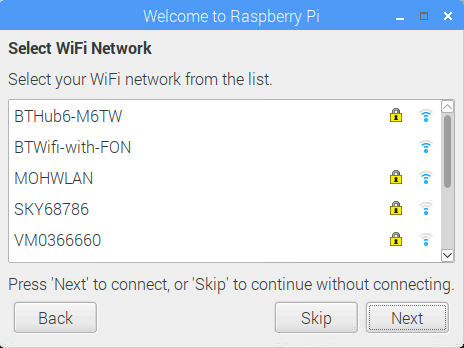

## Gorffen y gosodiad

Pan ddechreuwch eich Mws Môr am y tro cyntaf, bydd y rhaglen **Croeso i Fag Môr** yn ymddangos ac yn eich tywys trwy'r setiad cychwynnol.

+ Cliciwch **Nesaf** i gychwyn y setup.

+ Gosodwch eich **Gwlad**, **Iaith**, a **Amser**, yna cliciwch **Nesaf** eto.

+ Rhowch gyfrinair newydd ar gyfer eich Mws Mws a chliciwch ar **Nesaf**.

+ Cysylltwch â'ch rhwydwaith WiFi trwy ddewis ei enw, mynd i mewn i'r cyfrinair, a chlicio **Nesaf**.

**Sylwer:** os nad oes gan eich model Cig Mws â chysylltedd diwifr, ni welwch y sgrin hon.

+ Cliciwch **Nesaf** gadewch i'r dewin wirio am ddiweddariadau i Raspbian a'u gosod (efallai y bydd hyn yn cymryd ychydig o amser).

+ Cliciwch **Wedi'i wneud** neu **Ail-gychwyn** i orffen y gosodiad.

**Sylwer:** dim ond os oes angen i chi gwblhau'r diweddariad y bydd angen i chi ailgychwyn.

