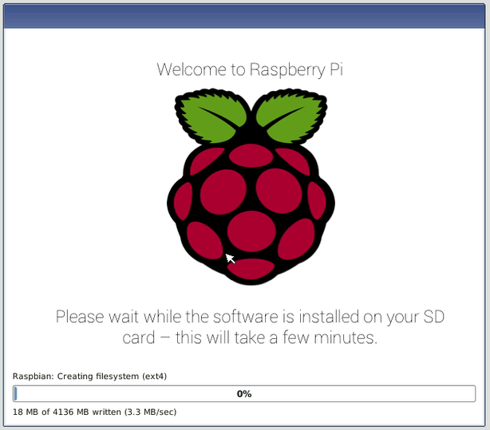

## Starten Sie Ihren Raspberry Pi

Ihr Raspberry Pi hat keinen Netzschalter: Sobald Sie ihn an eine Steckdose anschließen, wird er eingeschaltet. Beachten Sie, dass der Mikro-USB-Stromanschluss des Pi eine längere flache Seite oben hat.

+ Stecken Sie ein Micro-USB-Netzteil in eine Steckdose und verbinden Sie es mit dem Stromanschluss Ihres Pi.

Auf dem Raspberry Pi sollte eine rote LED aufleuchten, die anzeigt, dass der Pi an die Stromversorgung angeschlossen ist. Beim Start (das wird auch **Boot**) sehen Sie oben links auf Ihrem Bildschirm Himbeeren.

<video width="800" height="600" controls> <source src="images/piboot.webm" type="video/webm"> Ihr Browser unterstützt kein WebM-Video. Versuchen Sie also FireFox oder Chrome. </video> 

\--- Einsturz \---

* * *

## Titel: Erstmaliges Starten mit NOOBS

Wenn Sie das Raspberry Pi zum ersten Mal mit einer SD-Karte starten, die NOOBS enthält, sehen Sie das NOOBS-Installationsprogramm. Diese Software führt Sie durch die Installation des Raspbian-Betriebssystems (OS).

+ Wenn das Installationsprogramm geladen wurde, können Sie auswählen, welches Betriebssystem installiert werden soll. Aktivieren Sie das Kontrollkästchen für **Raspbian**, und klicken Sie dann auf **Installieren**.

+ Klicken Sie in der Warndialogbox auf **Ja** , und lehnen Sie sich zurück und entspannen Sie sich. Der Installationsprozess von Raspbian wird ein wenig dauern.

+ Wenn Raspbian installiert wurde, klicken Sie auf **OK**. Ihr Raspberry Pi wird neu gestartet und Raspbian wird dann hochfahren.

\--- / einklappen \---

Nach ein paar Sekunden erscheint der Raspbian Desktop.

