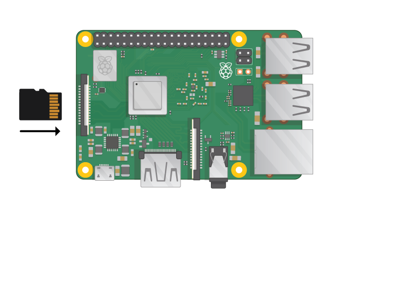
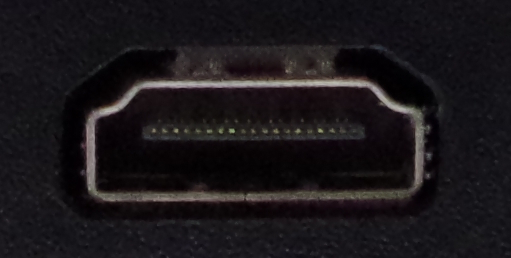
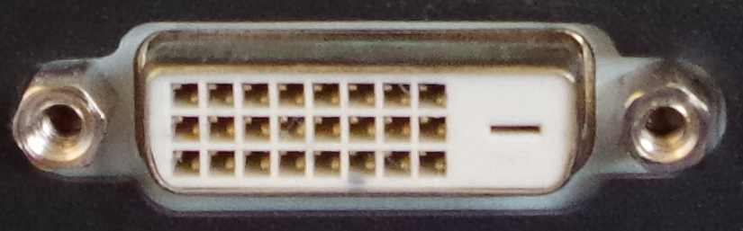
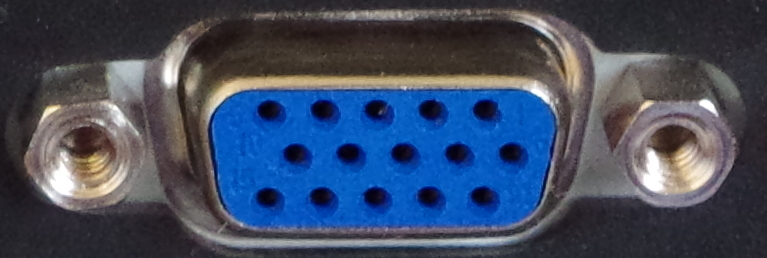
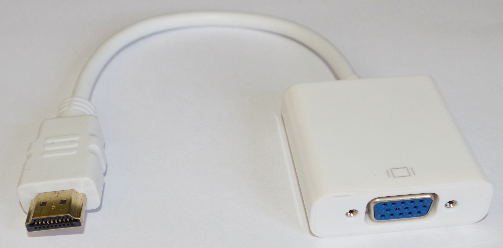

## What you will need

### Which Raspberry Pi?

There are several [models of Raspberry Pi](https://www.raspberrypi.org/products/), and for most people the Raspberry Pi 3 is the one to choose.

The Raspberry Pi 3 Model B+ is the newest, fastest, and easiest to use.

The Raspberry Pi Zero and Zero W are smaller and require less power, so they're useful for portable projects such as robots. It's generally easier to start a project with the Raspberry Pi 3, and to move to the Pi Zero when you have a working prototype that the smaller Pi would be useful for.

If you want to buy a Raspberry Pi, head to [rpf.io/products](https://rpf.io/products).

### A power supply

To connect to a power socket, the Raspberry Pi has a micro USB port (the same found that's found on many mobile phones).

You will need a power supply which provides at least 2.5 amps. We recommend using the [official Raspberry Pi power supply](https://www.raspberrypi.org/products/raspberry-pi-universal-power-supply/).

### A micro SD card

Your Raspberry Pi needs an SD card to store all its files and the Raspbian operating system.

You will need a micro SD card with a capacity of at least 8 GB.

Many sellers supply SD cards for Raspberry Pi that are already set up with Raspbian and ready to go.

### A keyboard and a mouse

To start using your Raspberry, you will need a USB keyboard and a USB mouse.

Once you've set your Pi up, you can use a Bluetooth keyboard and mouse, but you'll need a USB keyboard and mouse for setting up.

### A TV or computer screen

To view the Raspbian desktop environment, you will need a screen and a cable to link the screen and the Pi. The screen can be a TV or a computer monitor.

#### HDMI

The Raspberry Pi has a HDMI output port that is compatible with the HDMI port of most modern TVs and computer monitors. Many computer monitors may also have DVI or VGA ports.

#### DVI

If your screen has a DVI port, you can connect the Pi to it using a HDMI-to-DVI cable.

#### VGA

Some screens only have a VGA port.

To connect your Pi to such a screen, you can use a HDMI-to-VGA adapter.

### Optional: a case

You may want to put your Raspberry Pi in a case. This is not essential, but it will provide protection for your Pi. If you'd like, you can use the official case for the [Raspberry Pi 3](https://www.raspberrypi.org/products/raspberry-pi-3-case/) or [Pi Zero or Zero W](https://www.raspberrypi.org/products/raspberry-pi-zero-case/).

