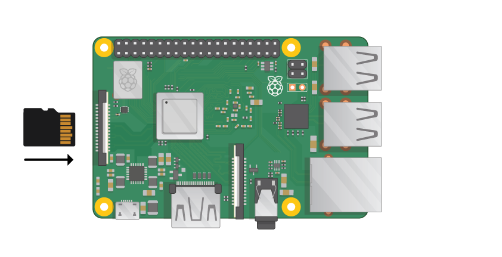

## What you will need

### What Raspberry Pi

There are several [models of Raspberry Pi](https://www.raspberrypi.org/products/) but for most people the Raspberry Pi 3 model B is the one to choose.

The Raspberry Pi 3 is the fastest and easiest to use.

The Raspberry Pi Zero and Zero W are smaller and require less power, making them useful for projects such as robotics but it is often easier to start with the Raspberry Pi 3 and move to the Pi Zero after everything is working.

For information on where to buy a Raspberry Pi, goto [rpf.io/products](https://rpf.io/products).

### Power supply

The Raspberry Pi has a micro USB connector to connect the power (the same as those found on many mobile phones).

You will need a power supply which provides at least 2.5 amps of power.

### SD Card

Your Raspberry Pi will need an SD card to store all its files and the Raspbian operating system.

You will need a Micro SD card with a capacity of at least 8 GB.

Many sellers supply SD cards for Raspberry Pi which are already setup and ready to go.

### Keyboard and Mouse

To use your Raspberry you will need a USB Keyboard and Mouse either wired or wireless.

Bluetooth keyboards and mice can be used, but you will need a USB keyboard and mouse initially to set it up.

### Screen

To view your Raspberry Pi you will need a screen, this can be a TV or a computer monitor and a cable to connect your Raspberry Pi to your screen.

#### HDMI

The Raspberry Pi has a HDMI output which should be compatible with most modern TV's.

Many computer monitors also have a HDMI connection, but they may also have DVI or VGA connections as well.

#### DVI

If your screen as a DVI connection you can connect to the screen using a simple HDMI to DVI cable.

#### VGA

If you screen only has a VGA connector you can use a HDMI to VGA adapter.

### Case

You may want to put your Raspberry Pi in a case. They are not essential but will provide protection for your Raspberry Pi.

