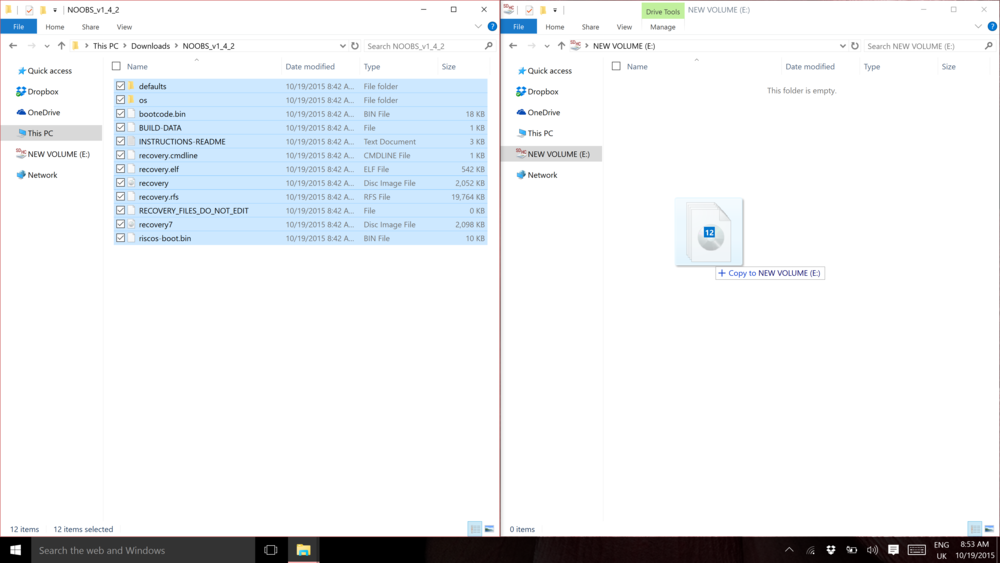

## Setup your SD Card

If you brought an SD card that wasn't pre-installed with Raspbian or you want to reset your Raspberry Pi you can install it yourself.

### Install Raspbian using NOOBS

Using NOOBS is the easiest way to install Raspbian on your SD card. To get hold of a copy of NOOBS:

#### Download NOOBS

+ Visit [www.raspberrypi.org/downloads/](https://www.raspberrypi.org/downloads/)

+ You should see a box with a link to the NOOBS files. Click on the link.

+ The simplest option is to download the zip archive of the files.

--- collapse ---

---
title: Windows - Copying noobs to your SD card
---

#### Format the SD Card

If the SD card on which you wish to install Raspbian currently has an older version of Raspbian on it, you may wish to back up the files from the card first, as they will be overwritten during this process.

+ Visit the SD Association’s website and download [SD Formatter 4.0](https://www.sdcard.org/downloads/formatter_4/index.html) for Windows or Mac.

+ Follow the instructions to install the software.

+ Insert your SD card into the computer or laptop’s SD card reader and make a note of the drive letter allocated to it, e.g. `F:/`.

+ In SD Formatter, select the drive letter for your SD card, and format it.

#### Extract NOOBS from the zip archive

Next, you will need to extract the files from the NOOBS zip archive you downloaded from the Raspberry Pi website.

+ Go to your *Downloads* folder and find the zip file you downloaded.

+ Extract the files and keep the resulting Explorer/Finder window open.

#### Copy the files

+ Now open another Explorer/Finder window and navigate to the SD card. It's best to position the two windows side by side.

+ Select all the files from the *NOOBS* folder and drag them onto the SD card.

  

+ Eject the SD card.

--- /collapse ---

--- collapse ---

---
title: MacOS - Copying noobs to your SD card
---

todo

--- /collapse ---

