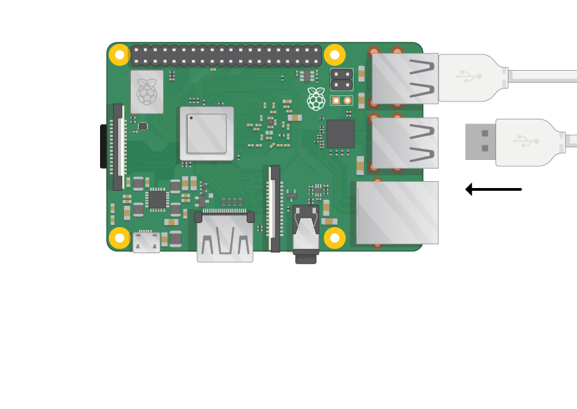

## Connect your Raspberry Pi

Let's get everything connected. It's important to do this in the right order, so that all your components are safe.

+ Insert the SD card you've set up with Raspbian (via NOOBS) into the micro SD card slot at the underside of your Pi. 

**Note:** Lots of micro SD cards will come inside a larger adapter — you can slide the card out using the lip at the bottom.

+ Find the USB cable for your mouse, and connect the mouse to a USB port on the Raspberry Pi (it doesn't matter which one).

+ Connect the keyboard in the same way.

+ Look at the HDMI port on the Raspberry Pi — notice that it has a large, flat side on top.

+ Make sure your screen is plugged into a wall socket and turned on. Use a cable to connect the screen to the Pi's HDMI port — use an adapter if necessary.

**Note:** nothing will display on the screen, because the Pi is not running yet.

+ If you want to connect the Pi to the internet via Ethernet, use an Ethernet cable to connect the Ethernet port on the Raspberry Pi to an Ethernet socket on the wall or on your internet router. You don't need to do this if you'll be using WiFi or if you don't want to connect to the internet.

+ Sound will come from your screen if it has speakers or you can connect headphones or speakers to the audio jack if you have them.

