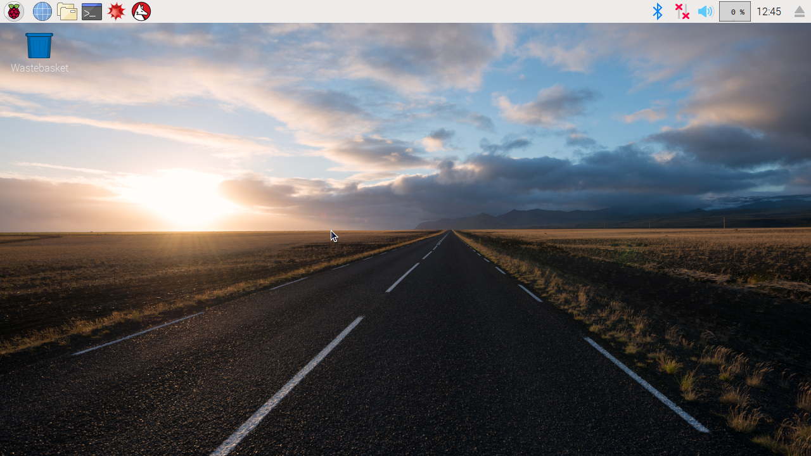

## Starting up your Raspberry Pi

Your Raspberry Pi doesnt have a power switch, as soon as you connect the power, it will turn on. Notice that the micro USB power port has a longer flat side on top.

--- task ---

Plug the power supply into a socket and connect it to the micro USB power port.

You should see a red light on the Raspberry Pi and it will start up.

--- /task ---

When you Raspberry Pi starts up (booting) you will see Raspberries appear in the top left of your screen.

!picture of raspberries

You will then see the boot up screen

!picture of boot up screen

--- collapse ---

---
title: First start up?
---

If this is the first time starting your Raspberry Pi you will see the Noobs installer

--- task ---

You will be offered a choice when the installer has loaded. You should check the box for **Raspbian**, and then click **Install**.

--- /task ---

--- task ---

Click **Yes** at the warning dialog, and then sit back and relax. It will take a while, but Raspbian will install.

--- /task ---

After a few seconds the Raspbian Desktop will appear.

