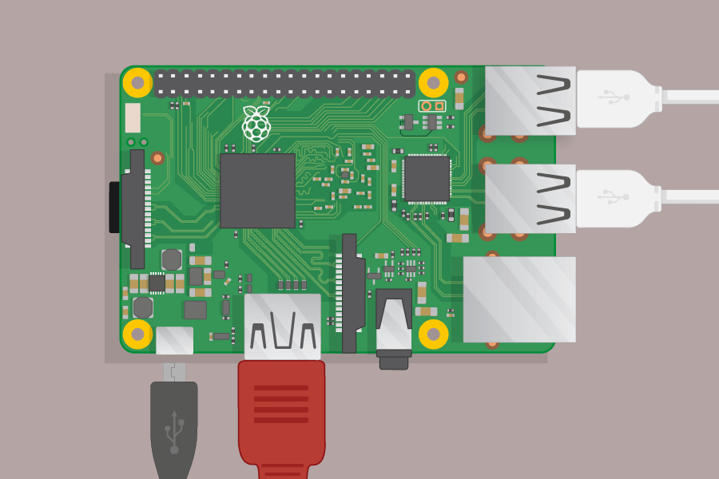
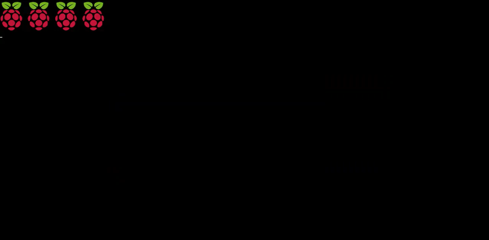
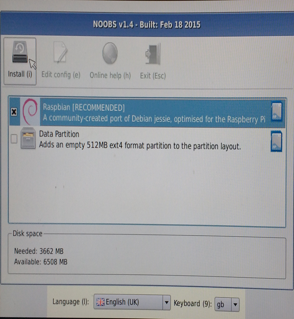

## Starting up your Raspberry Pi

Your Raspberry Pi doesnt have a power switch, as soon as you connect the power, it will turn on. Notice that the micro USB power port has a longer flat side on top.

+ Plug the power supply into a socket and connect it to the micro USB power port.

You should see a red light on the Raspberry Pi and it will start up.

When you Raspberry Pi starts up (booting) you will see Raspberries appear in the top left of your screen.

<video width="800" height="600" controls>
<source src="images/piboot.webm" type="video/webm">
Your browser does not support WebM video, so try FireFox or Chrome.
</video>

--- collapse ---

---
title: First start up after installing NOOBS?
---

If this is the first time starting your Raspberry Pi you will see the Noobs installer.

+ You will be offered a choice when the installer has loaded. You should check the box for **Raspbian**, and then click **Install**.

+ Click **Yes** at the warning dialog, and then sit back and relax. It will take a while, but Raspbian will install.

+ When Raspbian has been installed, click **OK** and your Raspberry Pi will restart and Raspbian will then boot up.

--- /collapse ---

After a few seconds the Raspbian Desktop will appear.

