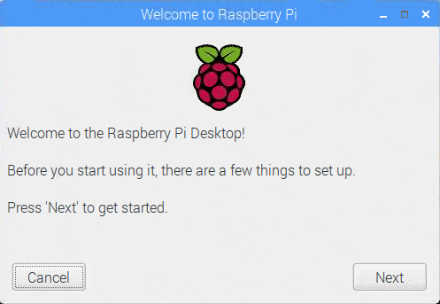
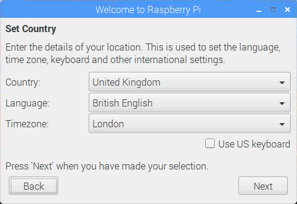
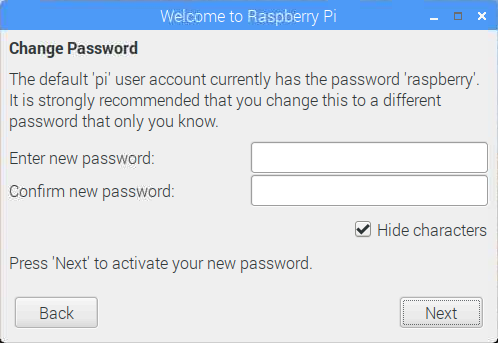
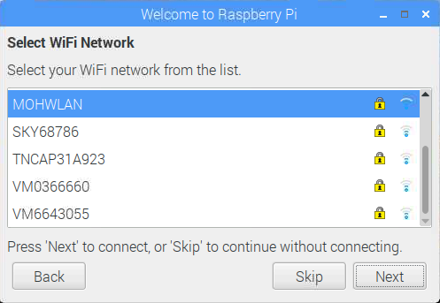
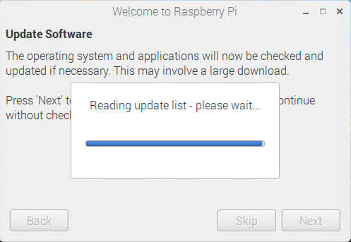
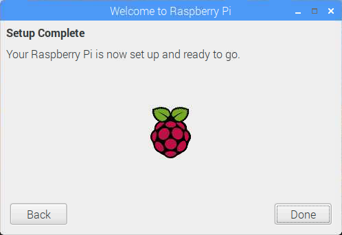

## Completing set up

When you first start your Raspberry Pi, the "Welcome to Raspberry Pi" set up application will start and guide you through the initial setup.

+ Click **Next** to start the wizard.

+ Set your **Country**, **Language** and **TimeZone** and click **Next**.

+ Enter a new password for your Raspberry Pi and click **Next**.

+ Select and connect to your WiFi network, by selecting your network, entering the password and clicking **Next**.

**Note:** if your Raspberry Pi does not have WiFi you wont see this screen.

+ Click **Next** to check for updates to Raspbian and install them (this might take a little while).

+ Click **Done** or **Reboot** to finish the set up.

**Note:** you will only need to reboot if required to complete a change.
