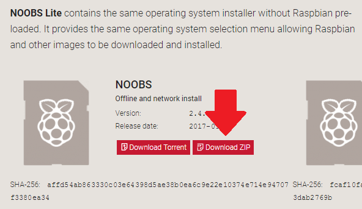

## Configura tu tarjeta SD

Si tiene una tarjeta SD que todavía no tiene el sistema operativo Raspbian, o si desea restablecer su Raspberry Pi, puede instalar fácilmente Raspbian usted mismo. Para hacerlo, necesita una computadora que tenga un puerto para tarjeta SD; la mayoría de las computadoras portátiles y de escritorio tienen una.

### El sistema operativo Raspbian a través de NOOBS

Usar el software NOOBS es la forma más fácil de instalar Raspbian en su tarjeta SD.

#### Descargar NOOBS

+ Visite las [descargas de Raspberry Pi en la página](https://www.raspberrypi.org/downloads).

+ Debería ver un cuadro que enlaza con los archivos de NOOBS. Haga clic en el cuadro.

+ La opción más simple es descargar el archivo zip de los archivos. Asegúrese de prestar atención a dónde guarda el archivo, para que pueda encontrarlo de nuevo rápidamente.

#### Formatee la tarjeta SD

Todo lo que está almacenado en la tarjeta SD se sobrescribirá durante el formateo. Entonces, si la tarjeta SD en la que desea instalar Raspbian actualmente tiene archivos, por ejemplo, de una versión anterior de Raspbian, es posible que desee respaldar estos archivos primero para no perderlos definitivamente.

+ Visite el sitio web de la Asociación SD y descargue [SD Formatter 4.0](https://www.sdcard.org/downloads/formatter_4/index.html) para Windows o Mac.

+ Siga las instrucciones para instalar el software.

+ Inserte su tarjeta SD en la ranura de la tarjeta SD de la computadora o la computadora portátil y anote la letra de la unidad asignada, por ejemplo `F: /`.

+ En SD Formatter, seleccione la letra de la unidad para su tarjeta SD y el formato de la tarjeta.

#### Extrae NOOBS del archivo zip

A continuación, deberá extraer los archivos del archivo zip de NOOBS que descargó del sitio web de Raspberry Pi.

+ Encuentra el archivo descargado: de forma predeterminada, debe estar en tu carpeta `Descargas`.

+ Haga doble clic en él para extraer los archivos y mantenga abierta la ventana resultante del Explorador / Buscador.

#### Copia los archivos

+ Ahora abra otra ventana Explorer / Finder y navegue a la tarjeta SD. Lo mejor es colocar las dos ventanas una al lado de la otra.

+ Seleccione todos los archivos en la carpeta `NOOBS` y arrástrelos a la ventana de la tarjeta SD para copiarlos a la tarjeta.

+ Once the files have all been copied over, you can eject the SD card.