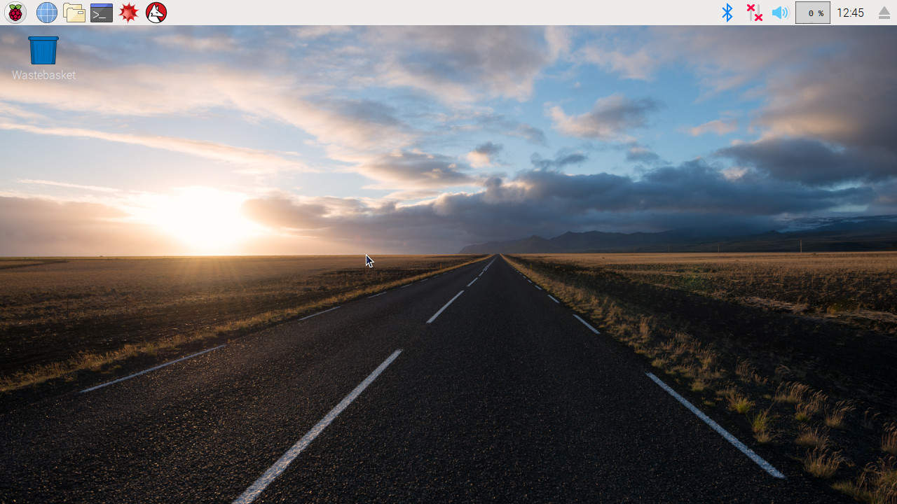

## Pon en marcha tu Raspberry Pi

Su Raspberry Pi no tiene un interruptor de encendido: tan pronto como lo conecte a una toma de corriente, se encenderá. Tenga en cuenta que el puerto de alimentación micro USB del Pi tiene un lado plano más largo en la parte superior.

+ Conecte una fuente de alimentación micro USB a un enchufe y conéctelo al puerto de alimentación de su Pi.

Debería ver un LED rojo encendido en la Raspberry Pi, que indica que el Pi está conectado a la corriente. A medida que se inicia (esto también se llama **arrancar**), verá frambuesas en la parte superior izquierda de su pantalla.

<video width="800" height="600" controls> <source src="images/piboot.webm" type="video/webm"> Su navegador no es compatible con videos de WebM, entonces intente Firefox o Chrome. </video> 

\--- colapso \---

* * *

## título: inicio por primera vez con NOOBS

Si esta es la primera vez que inicia su Raspberry Pi con una tarjeta SD que contiene NOOBS, verá el instalador de NOOBS. Este software lo guiará a través de la instalación del sistema operativo (SO) Raspbian.

+ Cuando el instalador se haya cargado, le ofrecerá una opción de qué sistema operativo instalar. Marque la casilla para **Raspbian**, y luego haga clic en **Install**.

+ Haga clic en **Sí** en el cuadro de diálogo de advertencia, y luego siéntese y relájese. El proceso de instalación de Raspbian llevará un poco de tiempo.

+ Cuando se haya instalado Raspbian, haga clic en **OK**. Su Raspberry Pi se reiniciará, y Raspbian se iniciará.

\--- /colapso \---

Después de unos segundos aparecerá Raspbian Desktop.

