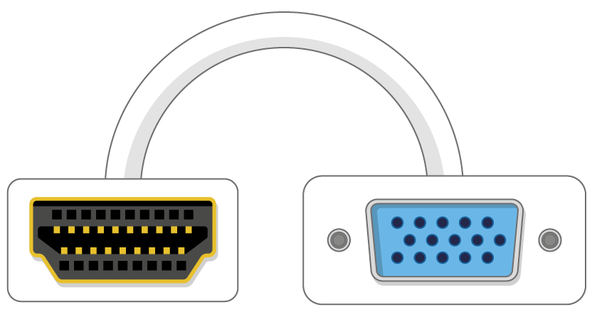

## Que necesitarás

### ¿Qué Raspberry Pi?

Hay varios modelos [de Raspberry Pi](https://www.raspberrypi.org/products/), y para la mayoría de las personas el Raspberry Pi 3 Model B + es el que debe elegir.

El Raspberry Pi 3 Model B + es el más nuevo, el más rápido y el más fácil de usar.

Las Raspberry Pi Zero y Zero W son más pequeñas y requieren menos energía, por lo que son útiles para proyectos portátiles como robots. En general, es más fácil comenzar un proyecto con Raspberry Pi 3, y pasar al Pi Zero cuando tienes un prototipo en funcionamiento para el que el Pi más pequeño sería útil.

Si quiere comprar una Raspberry Pi, diríjase a [rpf.io/products](https://rpf.io/products).

### Una fuente de alimentación

Para conectar a una toma de corriente, la Raspberry Pi tiene un puerto micro USB (el mismo que se encuentra en muchos teléfonos móviles).

Necesitará una fuente de alimentación que proporcione al menos 2.5 amperios. Se recomienda usar el [oficial Frambuesa Pi fuente de alimentación](https://www.raspberrypi.org/products/raspberry-pi-universal-power-supply/).

### Una tarjeta micro SD

Su Raspberry Pi necesita una tarjeta SD para almacenar todos sus archivos y el sistema operativo Raspbian.

Necesitará una tarjeta micro SD con una capacidad de al menos 8 GB.

Muchos vendedores suministran tarjetas SD para Raspberry Pi que ya están configuradas con Raspbian y listas para funcionar.

### Un teclado y un mouse

Para comenzar a usar su Raspberry, necesitará un teclado USB y un mouse USB.

Una vez que haya configurado su Pi, puede usar un teclado y mouse Bluetooth, pero necesitará un teclado USB y un mouse para configurarlo.

### Una pantalla de TV o computadora

Para ver el entorno de escritorio Raspbian, necesitará una pantalla y un cable para vincular la pantalla y el Pi. La pantalla puede ser un televisor o un monitor de computadora. Si la pantalla tiene parlantes incorporados, el Pi podrá usarlos para reproducir sonido.

#### HDMI

El Raspberry Pi tiene un puerto de salida HDMI que es compatible con el puerto HDMI de la mayoría de los televisores modernos y monitores de computadora. Muchos monitores de computadora también pueden tener puertos DVI o VGA.

#### DVI

Si su pantalla tiene un puerto DVI, puede conectar el Pi con un cable HDMI a DVI.

#### VGA

Algunas pantallas solo tienen un puerto VGA.

Para conectar su Pi a dicha pantalla, puede usar un adaptador de HDMI a VGA.

### Extras opcionales

#### Un caso

Es posible que desee poner su Raspberry Pi en un estuche. Esto no es esencial, pero brindará protección para su Pi. Si desea, puede utilizar el caso oficial para el [Frambuesa Pi 3](https://www.raspberrypi.org/products/raspberry-pi-3-case/) o [Pi Cero o Cero W](https://www.raspberrypi.org/products/raspberry-pi-zero-case/).

#### Auriculares o parlantes

Los grandes modelos de Raspberry Pi (no el Pi Zero / Zero W) tienen un puerto de audio estándar como el de su teléfono inteligente o reproductor de MP3. Si lo desea, puede conectar sus auriculares o parlantes para que el Pi pueda reproducir el sonido. Si la pantalla a la que está conectando su Pi tiene parlantes incorporados, el Pi puede reproducir el sonido a través de estos.

#### Un cable de Ethernet

Los grandes modelos de Raspberry Pi (no el Pi Zero / Zero W) tienen un puerto Ethernet estándar para conectarlos a Internet. Para conectar un Pi Zero a Internet, necesita un adaptador de USB a Ethernet. El Raspberry Pi 3 y Pi Zero W también se pueden conectar de forma inalámbrica a la web.