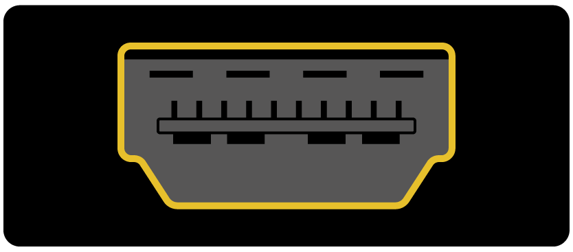

## Que necesitarás

### ¿Qué Raspberry Pi?

Hay varios modelos [de Raspberry Pi](https://www.raspberrypi.org/products/), y para la mayoría de las personas el Raspberry Pi 3 Model B + es el que debe elegir.

El Raspberry Pi 3 Model B + es el más nuevo, el más rápido y el más fácil de usar.

Las Raspberry Pi Zero y Zero W son más pequeñas y requieren menos energía, por lo que son útiles para proyectos portátiles como robots. En general, es más fácil comenzar un proyecto con Raspberry Pi 3, y pasar al Pi Zero cuando tienes un prototipo en funcionamiento para el que el Pi más pequeño sería útil.

Si quiere comprar una Raspberry Pi, diríjase a [rpf.io/products](https://rpf.io/products).

### Una fuente de alimentación

Para conectar a una toma de corriente, la Raspberry Pi tiene un puerto micro USB (el mismo que se encuentra en muchos teléfonos móviles).

Necesitará una fuente de alimentación que proporcione al menos 2.5 amperios. Se recomienda usar el [oficial Frambuesa Pi fuente de alimentación](https://www.raspberrypi.org/products/raspberry-pi-universal-power-supply/).

### Una tarjeta micro SD

Su Raspberry Pi necesita una tarjeta SD para almacenar todos sus archivos y el sistema operativo Raspbian.

Necesitará una tarjeta micro SD con una capacidad de al menos 8 GB.

Muchos vendedores suministran tarjetas SD para Raspberry Pi que ya están configuradas con Raspbian y listas para funcionar.

### A keyboard and a mouse

To start using your Raspberry, you will need a USB keyboard and a USB mouse.

Once you've set your Pi up, you can use a Bluetooth keyboard and mouse, but you'll need a USB keyboard and mouse for setting up.

### A TV or computer screen

To view the Raspbian desktop environment, you will need a screen and a cable to link the screen and the Pi. The screen can be a TV or a computer monitor. If the screen has built-in speakers, the Pi will be able to use these to play sound.

#### HDMI

The Raspberry Pi has a HDMI output port that is compatible with the HDMI port of most modern TVs and computer monitors. Many computer monitors may also have DVI or VGA ports.

#### DVI

If your screen has a DVI port, you can connect the Pi to it using a HDMI-to-DVI cable.

#### VGA

Some screens only have a VGA port.

To connect your Pi to such a screen, you can use a HDMI-to-VGA adapter.

### Optional extras

#### A case

You may want to put your Raspberry Pi in a case. This is not essential, but it will provide protection for your Pi. If you'd like, you can use the official case for the [Raspberry Pi 3](https://www.raspberrypi.org/products/raspberry-pi-3-case/) or [Pi Zero or Zero W](https://www.raspberrypi.org/products/raspberry-pi-zero-case/).

#### Headphones or speakers

The large Raspberry Pi models (not the Pi Zero/Zero W) have a standard audio port like the one on your smart phone or MP3 player. If you want to, you can connect your headphones or speakers so that the Pi can play sound. If the screen you're connecting your Pi to has built-in speakers, the Pi can play sound through these.

#### An Ethernet cable

The large Raspberry Pi models (not the Pi Zero/Zero W) have a standard Ethernet port to connect them to the internet. To connect a Pi Zero to the internet, you need a USB-to-Ethernet adaptor. The Raspberry Pi 3 and Pi Zero W can also be wirelessly connected to the web.