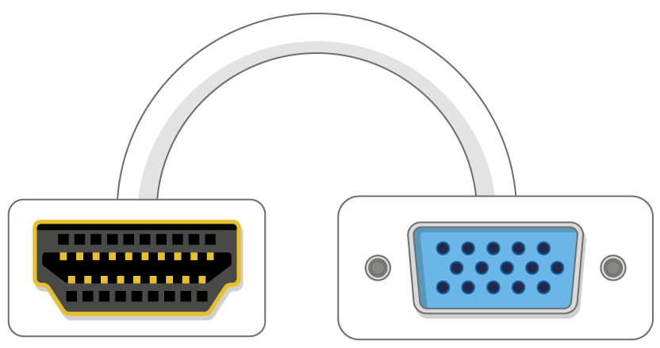

## Mitä tarvitset

### Mikä Raspberry Pi?

On olemassa useita [malleja Raspberry Pi](https://www.raspberrypi.org/products/), ja useimmat ihmiset Raspberry Pi 3 Malli B + on yksi valita.

Vadelma Pi 3 -malli B + on uusin, nopein ja helpoin käyttää.

Raspberry Pi Zero ja Zero W ovat pienempiä ja vaativat vähemmän tehoa, joten ne ovat hyödyllisiä kannettavissa projekteissa, kuten robotteissa. On yleensä helpompaa aloittaa projekti Raspberry Pi 3: n kanssa ja siirtyä pi-nollaan, kun sinulla on käytännöllinen prototyyppi, jota pienempi Pi olisi hyödyllinen.

Jos haluat ostaa Vadelma Pi, pistä [rpf.io/products](https://rpf.io/products).

### Virtalähde

Liittämällä pistorasiaan Raspberry Pi on mikro-USB-portti (sama löydetty, joka löytyy monilta matkapuhelimilta).

Tarvitset virtalähteen, joka tarjoaa vähintään 2,5 ampeeria. Suosittelemme [virallisen Raspberry Pi-virtalähteen](https://www.raspberrypi.org/products/raspberry-pi-universal-power-supply/).

### Mikro-SD-kortti

Raspberry Pi tarvitsee SD-kortin tallentamaan kaikki tiedostot ja Raspbian-käyttöjärjestelmä.

Tarvitset mikro SD-kortin, jonka kapasiteetti on vähintään 8 Gt.

Monet myyjät tarjoavat Raspberry Pi: n SD-kortteja, jotka on jo perustettu Raspbian-laitteella ja valmiina liikkeelle.

### Näppäimistö ja hiiri

Jotta voit käyttää vadelmasi, tarvitset USB-näppäimistön ja USB-hiiren.

Kun olet asettanut Pi ylös, voit käyttää Bluetooth-näppäimistöä ja hiirtä, mutta tarvitset USB-näppäimistön ja hiiren asetukset.

### Televisio tai tietokoneen näyttö

Jos haluat tarkastella Raspbian-työpöytäympäristöä, tarvitset näytön ja kaapelin, jolla voit liittää näytön ja Piin. Näyttö voi olla televisio tai tietokoneen näyttö. Jos näytössä on sisäänrakennetut kaiuttimet, Pi voi käyttää niitä toistamaan ääntä.

#### HDMI

Raspberry Pi: llä on HDMI-lähtöportti, joka on yhteensopiva nykyaikaisten televisioiden ja tietokoneiden näytön HDMI-portin kanssa. Monissa tietokonenäytöissä voi olla myös DVI- tai VGA-portteja.

#### DVI

Jos näytölläsi on DVI-portti, voit liittää Piin HDMI-DVI-kaapelilla.

#### VGA

Joissakin näytöissä on vain VGA-portti.

Pi: n kytkeminen tällaiseen näyttöön voi käyttää HDMI-VGA-sovitinta.

### Lisävarusteet

#### Tapaus

Voit halutessasi laittaa vadelmasi PI: n koteloon. Tämä ei ole välttämätöntä, mutta se suojaa Pi: täsi. Jos haluat, voit käyttää virallista tapausta [Vadelma Pi 3](https://www.raspberrypi.org/products/raspberry-pi-3-case/) tai [Pi Zero tai Zero W](https://www.raspberrypi.org/products/raspberry-pi-zero-case/).

#### Kuulokkeet tai kaiuttimet

Suuret Raspberry Pi -mallit (ei Pi Zero / Zero W) sisältävät tavallisen äänisataman, kuten älypuhelimesi tai MP3-soittimen. Jos haluat, voit liittää kuulokkeet tai kaiuttimet niin, että Pi voi toistaa ääntä. Jos Pi-liittymäsi näyttöön on sisäänrakennetut kaiuttimet, Pi voi soittaa ääntä näiden kautta.

#### Ethernet-kaapeli

Suuret Vadelma Pi -mallit (ei Pi Zero / Zero W) ovat standardi Ethernet-portti, jotta ne voidaan liittää internetiin. Pi-Zero-yhteyden muodostaminen Internetiin edellyttää USB-Ethernet-sovitinta. Raspberry Pi 3 ja Pi Zero W voidaan myös langattomasti liittää verkkoon.