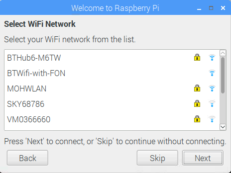

## Terminer l'installation

Lorsque vous démarrez votre Raspberry Pi pour la première fois, l'application **Welcome to Raspberry Pi** s'affiche et vous guide dans la configuration initiale.

+ Cliquez sur **Suivant** pour démarrer l'installation.

+ Définissez vos **Country**, **Language**et **Timezone**, puis cliquez de nouveau sur **Next**.

+ Entrez un nouveau mot de passe pour votre Raspberry Pi et cliquez sur **Suivant**.

+ Connectez-vous à votre réseau WiFi en sélectionnant son nom, en entrant le mot de passe et en cliquant sur **Suivant**.

**Remarque:** si votre modèle Raspberry Pi n'a pas de connectivité sans fil, vous ne verrez pas cet écran.

+ Cliquez sur **Suivant** Laissez l'assistant vérifier les mises à jour de Raspbian et les installer (cela peut prendre un peu de temps).

+ Cliquez sur **Terminé** ou **Reboot** pour terminer la configuration.

**Remarque:** vous aurez seulement besoin de redémarrer si nécessaire pour effectuer une mise à jour.

