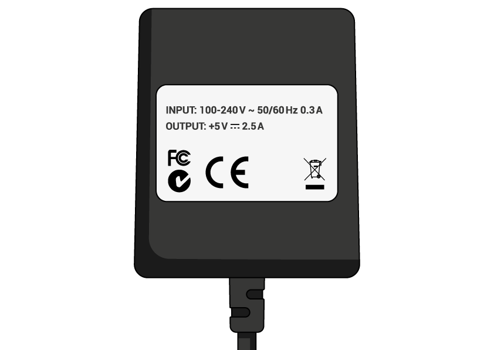
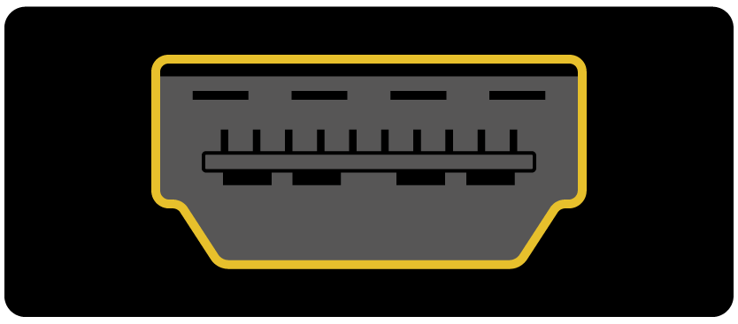

## Ce dont tu auras besoin

### Quel Raspberry Pi?

Il existe plusieurs modèles [de Raspberry Pi](https://www.raspberrypi.org/products/), et pour la plupart des gens, le Raspberry Pi 3 Model B + est celui à choisir.

Le Raspberry Pi 3 Model B + est le plus récent, le plus rapide et le plus facile à utiliser.

Le Raspberry Pi Zero et le Zero W sont plus petits et requièrent moins de puissance. Ils sont donc utiles pour les projets portables tels que les robots. Il est généralement plus facile de démarrer un projet avec le Raspberry Pi 3, et de passer au Pi Zero quand vous avez un prototype fonctionnel pour lequel le Pi plus petit serait utile.

Si vous voulez acheter un Raspberry Pi, rendez-vous sur [rpf.io/products](https://rpf.io/products).

### Une alimentation

Pour se connecter à une prise de courant, le Raspberry Pi possède un port micro-USB (le même que celui trouvé sur de nombreux téléphones mobiles).

Vous aurez besoin d'une alimentation qui fournit au moins 2,5 ampères. Nous vous recommandons d'utiliser l'alimentation [Raspberry Pi officielle](https://www.raspberrypi.org/products/raspberry-pi-universal-power-supply/).

### Une carte micro SD

Votre Raspberry Pi a besoin d'une carte SD pour stocker tous ses fichiers et le système d'exploitation Raspbian.

Vous aurez besoin d'une carte micro SD d'une capacité d'au moins 8 Go.

De nombreux vendeurs fournissent des cartes SD pour Raspberry Pi déjà installées avec Raspbian et prêtes à l'emploi.

### Un clavier et une souris

Pour commencer à utiliser votre Raspberry, vous aurez besoin d'un clavier USB et d'une souris USB.

Une fois que vous avez configuré votre Pi, vous pouvez utiliser un clavier et une souris Bluetooth, mais vous aurez besoin d'un clavier et d'une souris USB pour la configuration.

### Un téléviseur ou un écran d'ordinateur

Pour voir l'environnement de bureau Raspbian, vous aurez besoin d'un écran et d'un câble pour relier l'écran et le Pi. L'écran peut être un téléviseur ou un écran d'ordinateur. Si l'écran a des haut-parleurs intégrés, le Pi pourra les utiliser pour jouer du son.

#### HDMI

Le Raspberry Pi possède un port de sortie HDMI compatible avec le port HDMI de la plupart des téléviseurs et des moniteurs d'ordinateur modernes. De nombreux moniteurs d'ordinateur peuvent également avoir des ports DVI ou VGA.

#### DVI

Si votre écran est doté d'un port DVI, vous pouvez y connecter le Pi à l'aide d'un câble HDMI-DVI.

#### VGA

Certains écrans ont seulement un port VGA.

Pour connecter votre Pi à un tel écran, vous pouvez utiliser un adaptateur HDMI-VGA.

### Suppléments en option

#### Un cas

Vous pouvez mettre votre Raspberry Pi dans un étui. Ce n'est pas essentiel, mais il fournira une protection pour votre Pi. Si vous le souhaitez, vous pouvez utiliser le cas officiel pour le [Raspberry Pi 3](https://www.raspberrypi.org/products/raspberry-pi-3-case/) ou [Pi Zero ou Zero W](https://www.raspberrypi.org/products/raspberry-pi-zero-case/).

#### Casque ou haut-parleurs

Les grands modèles Raspberry Pi (pas le Pi Zero / Zero W) ont un port audio standard comme celui de votre téléphone intelligent ou lecteur MP3. Si vous le souhaitez, vous pouvez connecter vos écouteurs ou haut-parleurs pour que le Pi puisse reproduire le son. Si l'écran que vous connectez à votre Pi a des haut-parleurs intégrés, le Pi peut jouer du son à travers ceux-ci.

#### Un câble Ethernet

Les grands modèles Raspberry Pi (pas le Pi Zero / Zero W) ont un port Ethernet standard pour les connecter à Internet. Pour connecter un Pi Zero à Internet, vous avez besoin d'un adaptateur USB-Ethernet. Les Raspberry Pi 3 et Pi Zero W peuvent également être connectés sans fil à Internet.