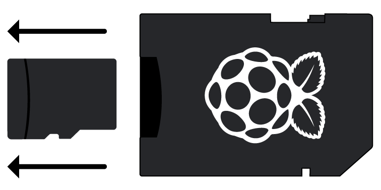

## Connectez votre Raspberry Pi

Allons tout connecté. Il est important de le faire dans le bon ordre, afin que tous vos composants soient sécurisés.

+ Insérez la carte SD que vous avez configurée avec Raspbian (via NOOBS) dans la fente pour carte micro SD située en dessous de votre Pi. 

**Remarque:** Beaucoup de cartes micro SD viendront à l'intérieur d'un adaptateur plus grand - vous pouvez faire glisser la carte en utilisant la lèvre en bas.

+ Trouvez le câble USB pour votre souris, et connectez la souris à un port USB sur le Raspberry Pi (peu importe lequel).

+ Connectez le clavier de la même manière.

+ Regardez le port HDMI sur le Raspberry Pi - notez qu'il a un grand côté plat sur le dessus.

+ Assurez-vous que votre écran est branché sur une prise murale et allumé. Utilisez un câble pour connecter l'écran au port HDMI du Pi - utilisez un adaptateur si nécessaire.

**Remarque:** rien ne s'affichera sur l'écran, car le Pi n'est pas encore lancé.

+ Si vous souhaitez connecter le Pi à Internet via Ethernet, utilisez un câble Ethernet pour connecter le port Ethernet du Raspberry Pi à une prise Ethernet murale ou sur votre routeur Internet. Vous n'avez pas besoin de le faire si vous utilisez le WiFi ou si vous ne voulez pas vous connecter à Internet.

+ Le son provient de votre écran s'il a des haut-parleurs ou vous pouvez connecter un casque ou des haut-parleurs à la prise audio si vous en avez.

