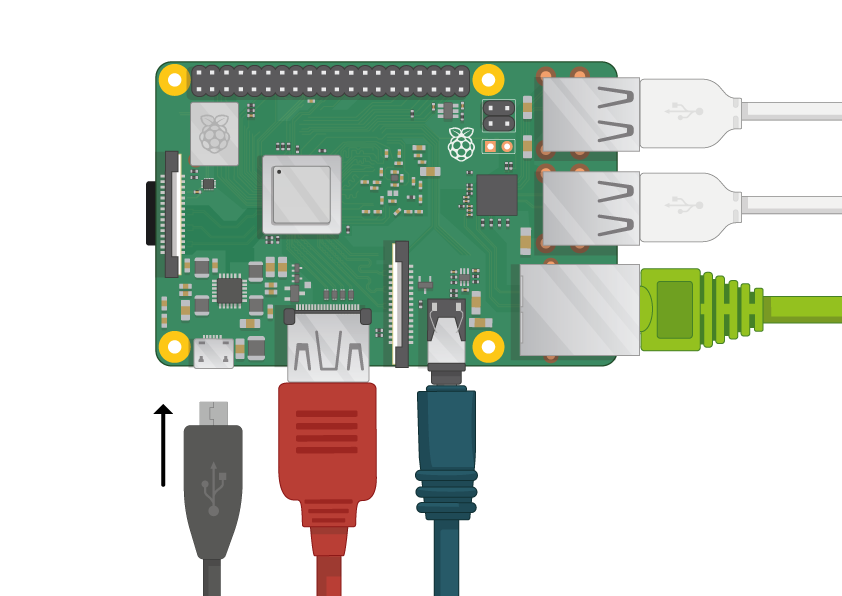

## अपने रास्पबेरी पाई को शुरू करना

आपके रास्पबेरी पाई में पावर स्विच नहीं है: जैसे ही आप इसे पावर आउटलेट से जोड़ते हैं, यह चालू हो जाएगा। ध्यान दें कि पाई के माइक्रो यूएसबी पावर पोर्ट की बगल की ऊपरी सतह लम्बी चपटी है।

+ सॉकेट में माइक्रो यूएसबी पावर सप्लाई प्लग करें और इसे पाई के पावर पोर्ट से जोड़े।

आपको रास्पबेरी पाई पर एक लाल एलईडी(LED) लाइट दिखेगी, जो इंगित करता है कि पाई शक्ति से जुड़ा गया है। जैसे ही यह शुरू होता है (इसे **बूटिंग**भी कहा जाता है), आप अपनी स्क्रीन के ऊपरी बाएं हाथ में रास्पबेरी दिखाई देगा।

<video width="800" height="600" controls> <source src="images/piboot.webm" type="video/webm"> आपका ब्राउज़र वेबएम(WebM) वीडियो का समर्थन नहीं करता है, इसलिए फ़ायरफ़ॉक्स या क्रोम आज़माएं। </video> 

\--- collapse \---

* * *

## title: एनओबीबीएस के साथ पहली बार स्टार्टअप

यदि यह पहली बार है कि आप अपने रास्पबेरी पाई को एनओबीबीएस(NOOBS) युक्त एक एसडी कार्ड के साथ शुरू कर रहे हैं, तो आप एनओयूबीएस इंस्टॉलर(NOOBS installer) देखेंगे। यह सॉफ्टवेयर आपको रास्पियन ऑपरेटिंग सिस्टम (ओएस) स्थापित करने के माध्यम से चलाएगा।

+ जब इंस्टॉलर लोड हो जाता है, तो यह आपको एक ओएस इंस्टॉल करने का विकल्प प्रदान करेगा। **रास्पियन**लिए बॉक्स को चेक करें, और उसके बाद **इंस्टॉल करें**क्लिक करें।

+ चेतावनी संवाद बॉक्स में **हां** क्लिक करें, और फिर वापस बैठें और आराम करें। रास्पियन स्थापना प्रक्रिया में थोड़ा समय लगेगा।

+ जब रास्पियन स्थापित किया गया है, तो **ठीक**क्लिक करें। आपका रास्पबेरी पाई फिर से शुरू हो जाएगा, और रास्पियन तब बूट हो जाएगा।

\--- / पतन \---

कुछ सेकंड के बाद रास्पियन डेस्कटॉप दिखाई देगा।

