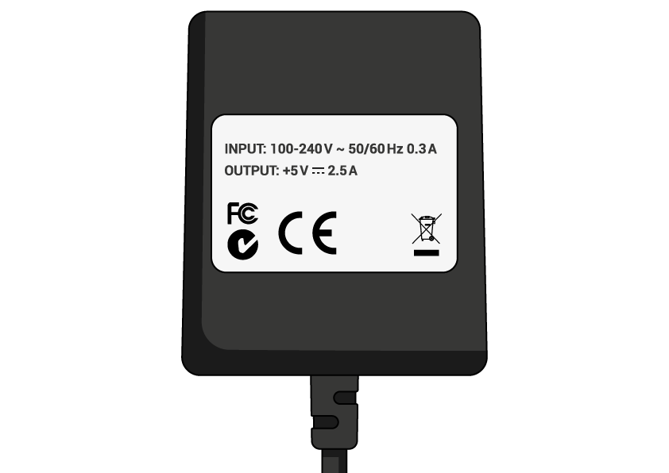

## Ono što će vam trebati

### Koji maloprodajni pi?

Postoji nekoliko [modeli malina Pi](https://www.raspberrypi.org/products/), a za većinu ljudi malina Pi 3 Model B + je jedan odabrati.

Raspberry Pi 3 Model B + je najnoviji, najbrži i najlakši za korištenje.

Raspberry Pi Zero i Zero W manji su i zahtijevaju manje energije pa su korisni za prijenosne projekte poput robota. Općenito je lakše započeti projekt s malinama Raspberry Pi 3 i premjestiti se na Pi Zero kada imate radni prototip da bi manji Pi bio koristan.

Ako želite kupiti Raspberry Pi, prijeđite na [rpf.io/products](https://rpf.io/products).

### Napajanje

Da biste se priključili na utičnicu, Raspberry Pi ima mikro USB priključak (isti je pronađen na mnogim mobilnim telefonima).

Trebat će vam napajanje koja osigurava najmanje 2,5 ampera. Preporučujemo korištenje [službenog napajanja Raspberry Pi](https://www.raspberrypi.org/products/raspberry-pi-universal-power-supply/).

### Mikro SD kartica

Vaša Raspberry Pi treba SD karticu za pohranu svih svojih datoteka i operacijskog sustava Raspbian.

Trebat će vam mikro SD kartica s kapacitetom od najmanje 8 GB.

Mnogi prodavači isporučuju SD kartice za Raspberry Pi koji su već postavljeni s Raspbian i spremni za odlazak.

### Tipkovnica i miš

Da biste počeli koristiti maline, trebat će vam USB tipkovnica i USB miš.

Nakon što postavite svoj Pi, možete koristiti Bluetooth tipkovnicu i miš, ali trebat će vam USB tipkovnica i miš za postavljanje.

### TV ili zaslon računala

Da biste vidjeli Raspbian desktop okruženje, trebat će vam ekran i kabel za povezivanje zaslona i Pi. Zaslon može biti TV ili monitor računala. Ako zaslon ima ugrađene zvučnike, Pi će ih moći koristiti za reprodukciju zvuka.

#### HDMI

Raspberry Pi ima HDMI izlazni priključak koji je kompatibilan s HDMI priključkom najsuvremenijih televizora i monitora računala. Mnogi monitori računala također mogu imati DVI ili VGA priključke.

#### DVI

Ako vaš zaslon ima DVI priključak, možete ga povezati pomoću HDMI-to-DVI kabela.

#### VGA

Neki zasloni imaju samo VGA priključak.

Za povezivanje Pi s takvim zaslonom, možete koristiti HDMI-to-VGA adapter.

### Dodatni sadržaji

#### Slučaj

Vi svibanj želite staviti svoje Raspberry Pi u slučaju. Ovo nije neophodno, ali će osigurati zaštitu vašeg Pi. Ako želite, možete koristiti službeni slučaj za [Raspberry Pi 3](https://www.raspberrypi.org/products/raspberry-pi-3-case/) ili [Pi Zero ili Zero W](https://www.raspberrypi.org/products/raspberry-pi-zero-case/).

#### Slušalice ili zvučnici

Veliki modeli Raspberry Pi (ne Pi Zero / Zero W) imaju standardni audio priključak kao što je onaj vaš pametni telefon ili MP3 player. Ako želite, možete spojiti svoje slušalice ili zvučnike tako da Pi može reproducirati zvuk. Ako zaslon koji povezujete s Piom ima ugrađene zvučnike, Pi može reproducirati zvuk kroz ove.

#### Ethernet kabel

Veliki modeli Raspberry Pi (ne Pi Zero / Zero W) imaju standardni Ethernet priključak za povezivanje s internetom. Da biste Pi Zero povezali s internetom, potreban vam je USB-to-Ethernet adapter. Raspberry Pi 3 i Pi Zero W također se mogu bežično spojiti na web.