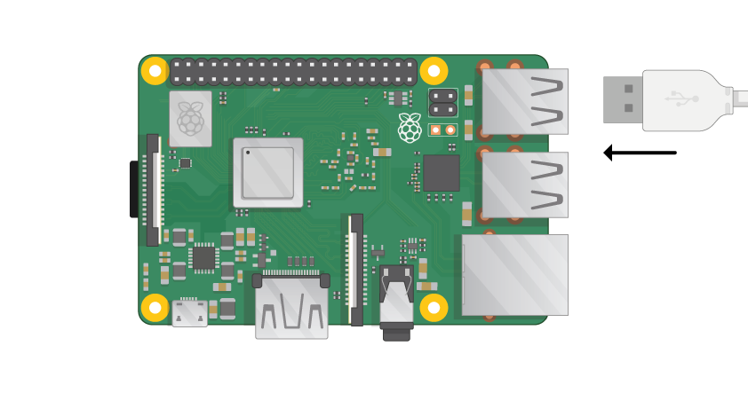

## Povežite svoj Raspberry Pi

Dajmo sve povezano. Važno je to učiniti u pravom redoslijedu, tako da su sve vaše komponente sigurne.

+ Umetnite SD karticu koju ste postavili pomoću Raspbian (putem NOOBS) u utor za mikro SD karticu na donjoj strani vašeg Pi. 

**Napomena:** Mnogo mikro SD kartica dolazi unutar većeg adaptera - možete izvaditi karticu pomoću usnice na dnu.

+ Pronađite USB kabel za miša i povežite miš s USB priključkom na maline Pi (nije bitno tko).

+ Povežite tipkovnicu na isti način.

+ Pogledajte HDMI priključak na Raspberry Pi - obavijestite da ima veliku, ravnu stranu na vrhu.

+ Provjerite je li zaslon priključen na zidnu utičnicu i uključen. Koristite kabel za spajanje zaslona na Pi HDMI priključak - ako je potrebno upotrijebite adapter.

**Napomena:** ništa se neće prikazati na zaslonu, jer Pi još nije pokrenut.

+ Ako želite povezati Pi s internetom preko Etherneta, koristite Ethernet kabel za spajanje Ethernet priključka na Raspberry Pi na Ethernet utičnicu na zidu ili na internetskom usmjerivaču. Ne morate to učiniti ako koristite WiFi ili ako se ne želite povezati s internetom.

+ Zvuk će doći s vašeg zaslona ako ima zvučnika ili možete spojiti slušalice ili zvučnike na audio priključnicu ako ih imate.

