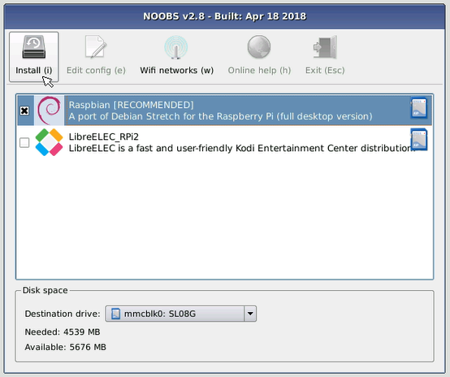

## Pokrenite svoj Malen Malen

Raspberry Pi nema prekidač napajanja: čim ga spojite na utičnicu, ona će se uključiti. Imajte na umu da Pi's micro USB utičnica ima dužu ravnu stranu na vrhu.

+ Priključite mikro-USB napajanje u utičnicu i spojite ga s Pi-ovim priključkom za napajanje.

Trebali biste vidjeti crvenu LED svjetiljku na malini Pi, što znači da je Pi povezan s napajanjem. Kako se pokreće (to se naziva i **podizanje sustava**), vidjet ćete maline koje se prikazuju u gornjem lijevom kutu zaslona.

<video width="800" height="600" controls> <source src="images/piboot.webm" type="video/webm"> Vaš preglednik ne podržava WebM video, pa pokušajte s FireFoxom ili Chromeom. </video> 

\--- kolaps \---

* * *

## naslov: Prvo puštanje u rad s NOOBS-om

Ako ovo prvi put pokrenete Raspberry Pi s SD karticom koja sadrži NOOBS, vidjet ćete instalacijski program za NOOBS. Ovaj softver će vas provesti kroz instaliranje operacijskog sustava Raspbian (OS).

+ Kada se instalacijski program učita, ponudit će vam odabir operacijskog sustava koji će se instalirati. Označite okvir za **Raspbian**, a zatim kliknite **Instaliraj**.

+ U dijaloškom okviru upozorenja kliknite **Da** , a zatim se opustite. Proces instalacije Raspbian će potrajati malo vremena.

+ Kad je instaliran Raspbian, kliknite **OK**. Vaša malina Pi će se ponovno pokrenuti, a Raspbian će se potom pokrenuti.

\--- /kolaps \---

Nakon nekoliko sekundi pojavit će se Raspalna radna površina.

