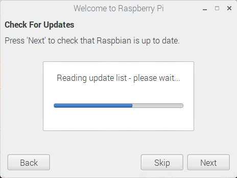

## Završite postavljanje

Kad prvi put pokrenete Raspberry Pi, aplikacija **Welcome to Raspberry Pi** će se pojaviti i voditi vas kroz početno podešavanje.

+ Kliknite **Dalje** za početak postavljanja.

+ Postavite svoju **zemlju**, **jezik**i **vremensku zonu**, a zatim ponovno **slijedeća**.

+ Unesite novu lozinku za Raspberry Pi i kliknite **sljedeći**.

+ Povežite se s Wi-Fi mrežom odabirom njezina imena, unosom zaporke i klikom na **sljedeće**.

**Napomena:** ako vaš model Raspberry Pi nema bežičnu povezivost, nećete vidjeti ovaj zaslon.

+ Kliknite **Dalje** neka čarobnjak provjerava ažuriranja Raspbian i instalira ih (to može potrajati malo).

+ Kliknite **Napunite** ili **Ponovno podizanje sustava** da biste dovršili postavljanje.

**Napomena:** morat ćete ponovno pokrenuti samo ako je to potrebno za dovršetak ažuriranja.

