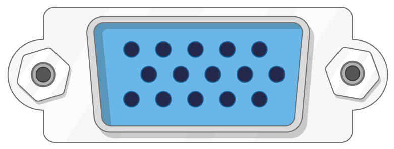

## Di cosa avrai bisogno

### Quale Raspberry Pi?

Ci sono diversi [modelli di Raspberry Pi](https://www.raspberrypi.org/products/), e per molte persone il modello Raspberry Pi 3 B + è quello da scegliere.

Il modello B + Raspberry Pi 3 è il più nuovo, veloce e facile da usare.

Raspberry Pi Zero e Zero W sono più piccoli e richiedono meno energia, quindi sono utili per progetti portatili come i robot. In genere è più facile avviare un progetto con Raspberry Pi 3 e passare a Pi Zero quando si dispone di un prototipo funzionante a cui sarebbe utile il Pi più piccolo.

Se vuoi comprare un Raspberry Pi, vai a [rpf.io/products](https://rpf.io/products).

### Un alimentatore

Per connettersi a una presa di corrente, il Raspberry Pi ha una porta micro USB (la stessa trovata che si trova su molti telefoni cellulari).

Avrai bisogno di un alimentatore che fornisca almeno 2,5 amp. Si consiglia di utilizzare il [ufficiale alimentazione Raspberry Pi](https://www.raspberrypi.org/products/raspberry-pi-universal-power-supply/).

### Una micro SD card

Il tuo Raspberry Pi ha bisogno di una scheda SD per archiviare tutti i suoi file e il sistema operativo Raspbian.

Avrai bisogno di una micro SD card con una capacità di almeno 8 GB.

Molti venditori forniscono schede SD per Raspberry Pi già configurate con Raspbian e pronte per l'uso.

### Una tastiera e un mouse

Per iniziare a utilizzare il tuo Raspberry, avrai bisogno di una tastiera USB e un mouse USB.

Una volta impostato il Pi, è possibile utilizzare una tastiera e un mouse Bluetooth, ma per la configurazione sono necessari una tastiera e un mouse USB.

### Uno schermo TV o computer

Per visualizzare l'ambiente desktop Raspbian, è necessario uno schermo e un cavo per collegare lo schermo e il Pi. Lo schermo può essere un televisore o un monitor di un computer. Se lo schermo ha altoparlanti incorporati, il Pi sarà in grado di usarli per riprodurre il suono.

#### HDMI

Il Raspberry Pi ha una porta di uscita HDMI che è compatibile con la porta HDMI della maggior parte dei moderni televisori e monitor di computer. Molti monitor per computer possono anche avere porte DVI o VGA.

#### DVI

Se il tuo schermo ha una porta DVI, puoi collegare il Pi ad esso usando un cavo HDMI-DVI.

#### VGA

Alcuni schermi hanno solo una porta VGA.

Per connettere il tuo Pi a tale schermo, puoi utilizzare un adattatore da HDMI a VGA.

### Extra opzionali

#### Un caso

Si consiglia di mettere il tuo Raspberry Pi in un caso. Questo non è essenziale, ma fornirà protezione per il tuo Pi. Se lo desideri, puoi utilizzare la custodia ufficiale per [Raspberry Pi 3](https://www.raspberrypi.org/products/raspberry-pi-3-case/) o [Pi Zero o Zero W](https://www.raspberrypi.org/products/raspberry-pi-zero-case/).

#### Cuffie o altoparlanti

I grandi modelli Raspberry Pi (non Pi Zero / Zero W) hanno una porta audio standard come quella del tuo smartphone o lettore MP3. Se lo si desidera, è possibile collegare le cuffie o gli altoparlanti in modo che il Pi possa riprodurre il suono. Se lo schermo con cui colleghi il tuo Pi ha altoparlanti incorporati, il Pi può riprodurre suoni attraverso questi.

#### Un cavo Ethernet

I grandi modelli Raspberry Pi (non Pi Zero / Zero W) hanno una porta Ethernet standard per collegarli a Internet. Per connettere un Pi Zero a Internet, è necessario un adattatore USB-Ethernet. Raspberry Pi 3 e Pi Zero W possono anche essere connessi in modalità wireless al web.