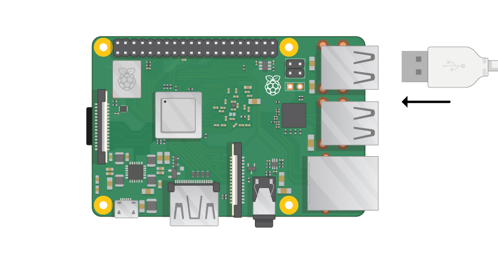

## 라즈베리 파이 연결

모든 것을 연결해 봅시다. 모든 구성 요소가 안전하도록 올바른 순서로이 작업을 수행하는 것이 중요합니다.

+ Raspbian으로 설정 한 SD 카드 (NOOBS를 통해)를 Pi의 밑면에있는 마이크로 SD 카드 슬롯에 넣습니다. 

**참고 :** 더 큰 어댑터 안에 많은 마이크로 SD 카드가 있습니다. 하단의 립을 사용하여 카드를 밀어 낼 수 있습니다.

+ 마우스의 USB 케이블을 찾고 마우스를 Raspberry Pi의 USB 포트에 연결하십시오 (어느 것이 든 상관 없습니다).

+ 동일한 방법으로 키보드를 연결하십시오.

+ Raspberry Pi의 HDMI 포트를 살펴보십시오. 상단에 크고 평평한면이 있습니다.

+ 화면이 콘센트에 꽂혀 있고 켜져 있는지 확인하십시오. 케이블을 사용하여 화면을 Pi의 HDMI 포트에 연결하십시오 - 필요한 경우 어댑터를 사용하십시오.

**주 :** 파이가 아직 실행되고 있지 않기 때문에 아무것도 화면에 표시되지 않습니다.

+ 파이를 이더넷을 통해 인터넷에 연결하려면 이더넷 케이블을 사용하여 라즈베리 파이의 이더넷 포트를 벽면의 이더넷 소켓이나 인터넷 라우터에 연결하십시오. Wi-Fi를 사용하거나 인터넷에 연결하지 않으려는 경우에는이 작업을 수행 할 필요가 없습니다.

+ 스피커가있는 경우 사운드가 화면에서 나 오거나 오디오 잭에 헤드폰이나 스피커를 연결할 수 있습니다.

