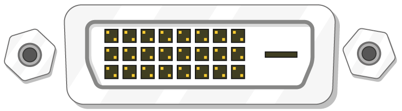

## Apa yang anda perlukan

### Raspberry Pi mana?

Terdapat beberapa [model Raspberry Pi](https://www.raspberrypi.org/products/), dan bagi kebanyakan orang yang Raspberry Pi 3 Model B + adalah salah satu untuk memilih.

Raspberry Pi 3 Model B + adalah yang terbaru, terpantas, dan paling mudah digunakan.

Raspberry Pi Zero dan Zero W lebih kecil dan memerlukan kuasa kurang, jadi ia berguna untuk projek mudah alih seperti robot. Secara amnya lebih mudah untuk memulakan projek dengan Raspberry Pi 3, dan berpindah ke Pi Zero apabila anda mempunyai prototaip kerja yang Pi yang lebih kecil akan berguna.

Jika anda ingin membeli Raspberry Pi, pergi ke [rpf.io/products](https://rpf.io/products).

### Bekalan kuasa

Untuk menyambung ke soket kuasa, Raspberry Pi mempunyai port mikro USB (yang sama dijumpai yang terdapat di banyak telefon bimbit).

Anda memerlukan bekalan kuasa yang menyediakan sekurang-kurangnya 2.5 amps. Kami mengesyorkan menggunakan bekalan rasmi Raspberry Pi [rasmi](https://www.raspberrypi.org/products/raspberry-pi-universal-power-supply/).

### Kad SD mikro

Raspberry Pi anda memerlukan kad SD untuk menyimpan semua failnya dan sistem operasi Raspbian.

Anda memerlukan kad SD mikro dengan kapasiti sekurang-kurangnya 8 GB.

Ramai penjual membekalkan kad SD untuk Raspberry Pi yang sudah ditubuhkan dengan Raspbian dan bersedia untuk pergi.

### Papan kekunci dan tetikus

Untuk mula menggunakan Raspberry anda, anda memerlukan papan kekunci USB dan tetikus USB.

Sebaik sahaja anda telah menetapkan Pi anda, anda boleh menggunakan papan kekunci dan tetikus Bluetooth, tetapi anda memerlukan papan kekunci USB dan tetikus untuk menyediakan.

### Skrin TV atau komputer

Untuk melihat persekitaran desktop Raspbian, anda memerlukan skrin dan kabel untuk memautkan skrin dan Pi. Skrin boleh menjadi TV atau monitor komputer. Jika skrin mempunyai pembesar suara terbina dalam, Pi akan dapat menggunakannya untuk memainkan bunyi.

#### HDMI

Raspberry Pi mempunyai port keluaran HDMI yang serasi dengan port HDMI TV paling moden dan monitor komputer. Ramai monitor komputer juga mungkin mempunyai port DVI atau VGA.

#### DVI

Jika skrin anda mempunyai port DVI, anda boleh menyambungkan Pi itu menggunakan kabel HDMI-ke-DVI.

#### VGA

Sesetengah skrin hanya mempunyai port VGA.

Untuk menyambung Pi anda ke skrin sedemikian, anda boleh menggunakan penyesuai HDMI-ke-VGA.

### Tambahan pilihan

#### Kes

Anda mungkin mahu meletakkan Ras Raspberry Pi anda dalam kes. Ini tidak penting, tetapi ia akan memberi perlindungan kepada Pi anda. Jika anda mahu, anda boleh menggunakan kes rasmi untuk [Raspberry Pi 3](https://www.raspberrypi.org/products/raspberry-pi-3-case/) atau [Pi Zero atau Zero W](https://www.raspberrypi.org/products/raspberry-pi-zero-case/).

#### Fon kepala atau pembesar suara

Model Raspberry Pi yang besar (bukan Pi Zero / Zero W) mempunyai port audio standard seperti yang ada di telefon pintar atau pemain MP3 anda. Sekiranya anda mahu, anda boleh menyambungkan fon kepala atau pembesar suara supaya Pi dapat bermain dengan bunyi. Jika skrin anda menyambungkan Pi anda untuk mempunyai pembesar suara terbina dalam, Pi boleh memainkan bunyi melalui ini.

#### Kabel Ethernet

Model Raspberry Pi yang besar (bukan Pi Zero / Zero W) mempunyai port Ethernet standard untuk menyambungkannya ke internet. Untuk menyambungkan Pi Zero ke internet, anda perlu penyesuai USB-ke-Ethernet. Raspberry Pi 3 dan Pi Zero W juga boleh disambung secara wayarles ke web.