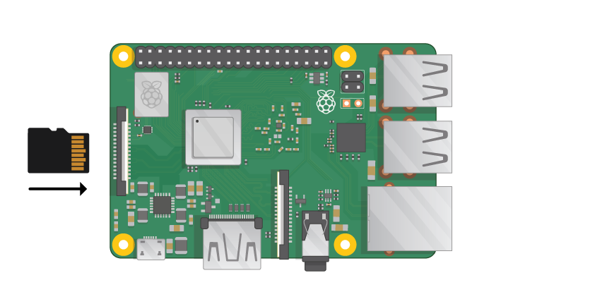

## Sambungkan Raspberry Pi anda

Mari dapatkan segala yang berkaitan. Penting untuk melakukan ini dengan betul, supaya semua komponen anda selamat.

+ Masukkan kad SD yang telah anda sediakan dengan Raspbian (melalui NOOBS) ke dalam slot kad SD mikro di bahagian bawah Pi anda. 

**Nota:** Banyak kad SD mikro akan masuk ke penyesuai yang lebih besar - anda boleh slaid kad keluar menggunakan bibir di bahagian bawah.

+ Cari kabel USB untuk tetikus anda, dan sambungkan tetikus ke port USB pada Raspberry Pi (tidak kira yang mana satu).

+ Sambungkan papan kekunci dengan cara yang sama.

+ Lihatlah port HDMI di Raspberry Pi - perhatikan bahawa ia mempunyai sisi yang besar dan rata di atas.

+ Pastikan skrin anda dipasang ke soket dinding dan dihidupkan. Gunakan kabel untuk menyambung skrin ke port HDMI Pi - gunakan penyesuai jika perlu.

**Nota:** tiada apa yang akan dipaparkan pada skrin, kerana Pi tidak berjalan lagi.

+ Jika anda ingin menyambungkan Pi ke internet melalui Ethernet, gunakan kabel Ethernet untuk menyambungkan port Ethernet pada Raspberry Pi ke soket Ethernet di dinding atau di penghala internet anda. Anda tidak perlu melakukan ini jika anda menggunakan WiFi atau jika anda tidak mahu menyambung ke internet.

+ Bunyi akan datang dari skrin anda jika ia mempunyai penceramah atau anda boleh menyambungkan fon kepala atau penceramah ke bicu audio jika anda mempunyainya.

