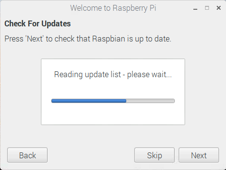

## Selesaikan persediaan

Apabila anda memulakan Raspberry Pi buat kali pertama, **Selamat datang ke aplikasi Raspberry Pi** akan muncul dan membimbing anda melalui persediaan awal.

+ Klik **Next** untuk memulakan persediaan.

+ Tetapkan **Negara**, **Bahasa**, dan **Zon**, kemudian klik **Next** lagi.

+ Masukkan kata laluan baru untuk Ras Raspberry Pi anda dan klik **Seterusnya**.

+ Sambungkan ke rangkaian WiFi anda dengan memilih namanya, memasukkan kata laluan, dan mengklik **Seterusnya**.

**Nota:** jika model Raspberry Pi anda tidak mempunyai sambungan wayarles, anda tidak akan melihat skrin ini.

+ Klik **Next** biarkan penyihir memeriksa pembaruan untuk Raspbian dan pasangnya (ini mungkin mengambil sedikit masa).

+ Klik **Selesai** atau **Reboot** untuk menyelesaikan persediaan.

**Nota:** anda hanya perlu reboot jika perlu untuk menyelesaikan kemas kini.

