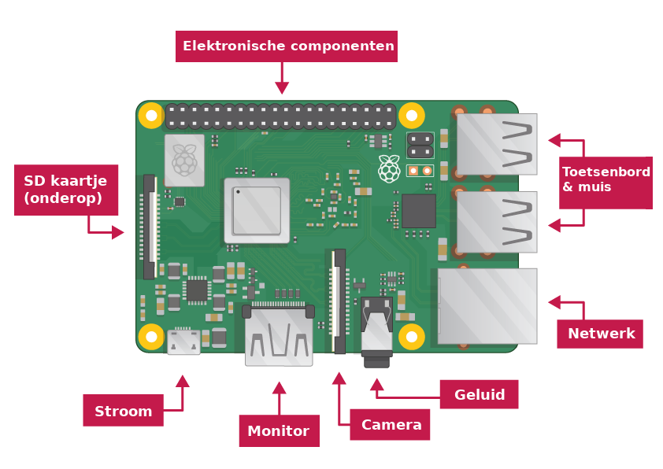

## Verbind de Raspberry Pi

We gaan alles aansluiten. Om geen schade aan de onderdelen te krijgen is het belangrijk om dit in de juiste volgorde te doen.

+ Plaats de SD-kaart met Raspbian (via NOOBS) in de micro SD-kaartsleuf aan de onderkant van de Pi. 

**Opmerking:** veel micro SD-kaarten zitten in een grotere adapter - je kunt de kaart eruit schuiven door te trekken aan het lipje onderaan.

+ Sluit de USB-kabel voor je muis aan op een USB-poort op de Raspberry Pi (het maakt niet uit welke).

+ Verbind het toetsenbord op dezelfde manier.

+ Kijk naar de HDMI-poort van de Raspberry Pi - merk op dat die een grote, vlakke kant aan de bovenkant heeft.

+ Zorg ervoor dat het scherm op een stopcontact is aangesloten en is ingeschakeld. Gebruik een kabel om het scherm op de HDMI-poort van de Pi aan te sluiten - gebruik indien nodig een adapter.

**Opmerking:** er wordt niets op het scherm weergegeven omdat de Pi nog niet actief is.

+ Als je de Pi via Ethernet op het internet wilt aansluiten, gebruik je een Ethernet-kabel om de Ethernet-poort op de Raspberry Pi aan te sluiten op een Ethernet-aansluiting aan de muur of op de internetrouter. Dit is niet nodig als je WiFi gebruikt of als je geen verbinding met internet wilt maken.

+ Geluid zal van het scherm komen als die luidsprekers heeft of je sluit een hoofdtelefoon of luidsprekers aan op de audio-uitgang.

