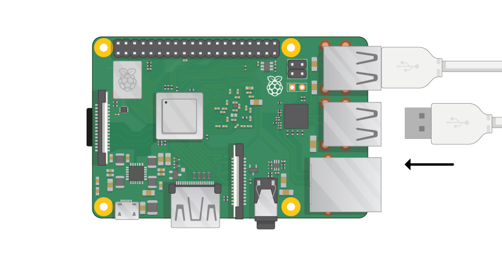

## Verbind je Raspberry Pi

Laten we alles met elkaar in verband brengen. Het is belangrijk om dit in de juiste volgorde te doen, zodat al uw componenten veilig zijn.

+ Plaats de SD-kaart die u hebt ingesteld met Raspbian (via NOOBS) in de micro SD-kaartsleuf aan de onderkant van uw Pi. 

**Opmerking:** Veel micro SD-kaarten komen in een grotere adapter - je kunt de kaart eruit schuiven met de lip onderaan.

+ Zoek de USB-kabel voor je muis en sluit de muis aan op een USB-poort op de Raspberry Pi (het maakt niet uit welke).

+ Verbind het toetsenbord op dezelfde manier.

+ Kijk naar de HDMI-poort van de Raspberry Pi - merk op dat deze een grote, vlakke kant aan de bovenkant heeft.

+ Zorg ervoor dat uw scherm op een stopcontact is aangesloten en is ingeschakeld. Gebruik een kabel om het scherm op de HDMI-poort van de Pi aan te sluiten - gebruik indien nodig een adapter.

**Opmerking:** niets wordt op het scherm weergegeven, omdat de Pi nog niet actief is.

+ Als u de Pi via Ethernet op het internet wilt aansluiten, gebruikt u een Ethernet-kabel om de Ethernet-poort op de Raspberry Pi aan te sluiten op een Ethernet-aansluiting aan de muur of op uw internetrouter. U hoeft dit niet te doen als u WiFi gebruikt of als u geen verbinding met internet wilt maken.

+ Geluid zal van uw scherm komen als het luidsprekers heeft of u kunt een koptelefoon of luidsprekers op de audio jack aansluiten als u die heeft.

