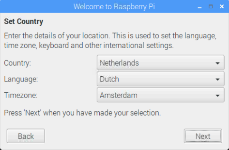

## Voltooi de installatie

Als je de Raspberry Pi voor de eerste keer opstart, zal de toepassing **Welcome to Raspberry Pi** verschijnen en je door de eerste installatie leiden.

+ Klik op **Next** (volgende) om de installatie te starten.

+ Stel je **Country **(Land), **Language **(Taal) en **Timezone **(Tijdzone) in en klik vervolgens opnieuw op **Next**.

+ Voer een nieuw wachtwoord in voor de Raspberry Pi en klik op **Next**. Let op! als je bijzondere tekens (=, - enz) gebruikt in je wachtwoord klik dan eerst op het vinkje bij "Hide passwords" zodat je ziet wat je typt.

+ Maak verbinding met het wifi-netwerk door de naam te selecteren, het wachtwoord in te voeren en op **Next** te klikken.

**Opmerking:** als het Raspberry Pi-model geen draadloze verbinding heeft, zie je dit scherm niet.

+ Klik op **Next** en laat het programma controleren of er updates zijn voor Raspbian en installeer ze dan (dit kan even duren).

+ Klik op **Done** (gedaan) of **Reboot** (opnieuw opstarten) om de installatie te voltooien.

**Opmerking:** je hoeft alleen opnieuw op te starten als dat nodig is om een ​​update te voltooien.

