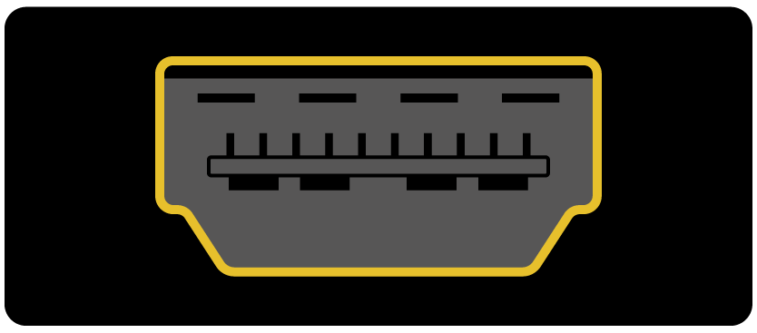

## Co będzie potrzebne

### Które Raspberry Pi?

Istnieje kilka [modele Raspberry Pi](https://www.raspberrypi.org/products/), a dla większości ludzi Raspberry Pi 3 Model B + to jeden do wyboru.

Raspberry Pi 3 Model B + to najnowszy, najszybszy i najłatwiejszy w użyciu.

Raspberry Pi Zero i Zero W są mniejsze i wymagają mniej mocy, więc są przydatne w przenośnych projektach, takich jak roboty. Zasadniczo łatwiej jest rozpocząć projekt z Raspberry Pi 3 i przejść do Pi Zero, gdy masz działający prototyp, który byłby przydatny dla mniejszego Pi.

Jeśli chcesz kupić Raspberry Pi, przejdź do [rpf.io/products](https://rpf.io/products).

### Zasilanie

Aby połączyć się z gniazdem zasilania, Raspberry Pi ma port micro USB (taki sam, który można znaleźć na wielu telefonach komórkowych).

Będziesz potrzebował zasilacza, który zapewnia co najmniej 2,5 ampera. Zalecamy użycie [oficjalnego zasilacza Raspberry Pi](https://www.raspberrypi.org/products/raspberry-pi-universal-power-supply/).

### Karta micro SD

Twój Raspberry Pi potrzebuje karty SD do przechowywania wszystkich swoich plików i systemu operacyjnego Raspbian.

Będziesz potrzebował karty micro SD o pojemności co najmniej 8 GB.

Wielu sprzedawców dostarcza karty SD dla Raspberry Pi, które są już skonfigurowane z Raspbian i gotowe do pracy.

### Klawiatura i mysz

Aby zacząć korzystać z malin, potrzebujesz klawiatury USB i myszy USB.

Po ustawieniu Pi-up możesz użyć klawiatury i myszy Bluetooth, ale do konfiguracji potrzebujesz klawiatury i myszy USB.

### Telewizor lub ekran komputera

Aby wyświetlić środowisko pulpitu Raspbian, potrzebny będzie ekran i kabel do połączenia ekranu i pi. Ekran może być ekranem telewizora lub monitora komputerowego. Jeśli ekran ma wbudowane głośniki, Pi będzie w stanie je wykorzystać do odtwarzania dźwięku.

#### HDMI

Raspberry Pi ma port wyjściowy HDMI, który jest kompatybilny z portem HDMI większości nowoczesnych telewizorów i monitorów komputerowych. Wiele monitorów komputerowych może mieć także porty DVI lub VGA.

#### DVI

Jeśli twój ekran ma port DVI, możesz podłączyć go do niego za pomocą kabla HDMI-DVI.

#### VGA

Niektóre ekrany mają tylko port VGA.

Aby podłączyć Pi do takiego ekranu, możesz użyć przejściówki HDMI-na-VGA.

### Opcjonalne dodatki

#### Sprawa

Możesz umieścić swoje Raspberry Pi w pudełku. To nie jest istotne, ale zapewni ochronę dla twojego Pi. Jeśli chcesz, możesz użyć oficjalnego przypadku dla [Raspberry Pi 3](https://www.raspberrypi.org/products/raspberry-pi-3-case/) lub [Pi Zero lub Zero W](https://www.raspberrypi.org/products/raspberry-pi-zero-case/).

#### Słuchawki lub głośniki

Duże modele Raspberry Pi (nie Pi Zero / Zero W) mają standardowy port audio, taki jak na smartfonie lub odtwarzaczu MP3. Jeśli chcesz, możesz podłączyć słuchawki lub głośniki, aby Pi mogło odtwarzać dźwięk. Jeśli ekran, do którego podłączasz Pi ma wbudowane głośniki, Pi może odtwarzać dźwięk przez te.

#### Kabel Ethernet

Duże modele Raspberry Pi (nie Pi Zero / Zero W) mają standardowy port Ethernet do łączenia ich z Internetem. Aby podłączyć komputer Pi Zero do Internetu, potrzebujesz adaptera USB do Ethernet. Raspberry Pi 3 i Pi Zero W można również bezprzewodowo podłączyć do sieci.