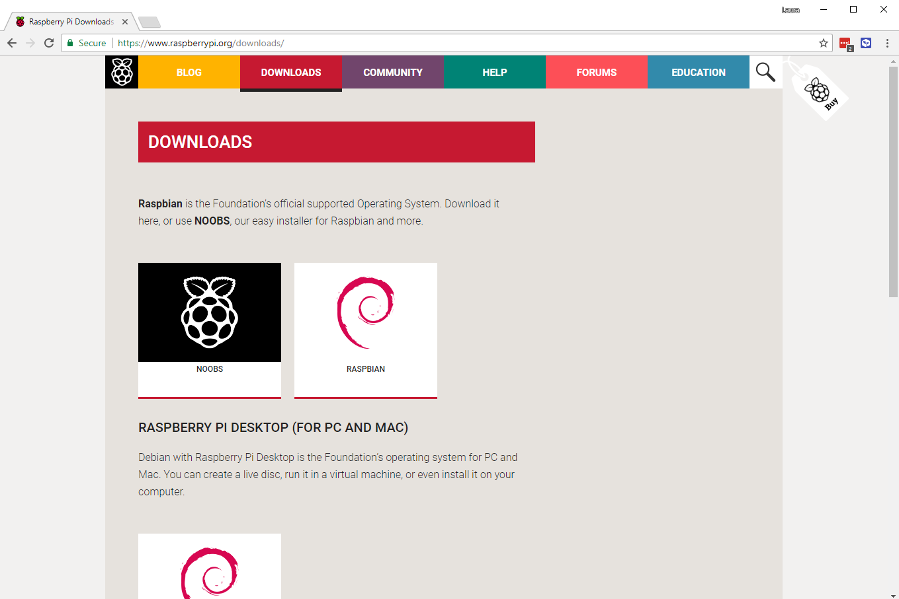

## Skonfiguruj kartę SD

Jeśli masz kartę SD, na której nie ma jeszcze systemu operacyjnego Raspbian, lub jeśli chcesz zresetować Raspberry Pi, możesz łatwo zainstalować Raspboga samemu. Aby to zrobić, potrzebujesz komputera z portem kart SD - większość komputerów przenośnych i stacjonarnych ma taki.

### System operacyjny Raspbian za pośrednictwem NOOBS

Korzystanie z oprogramowania NOOBS to najprostszy sposób na zainstalowanie Raspbian na karcie SD.

#### Pobierz NOOBS

+ Odwiedź stronę [pobierania Raspberry Pi na stronie](https://www.raspberrypi.org/downloads).

+ Powinieneś zobaczyć pole z linkami do plików NOOBS. Kliknij pole.

+ Najprostszą opcją jest pobranie archiwum zip z plików. Zwróć uwagę na to, gdzie zapiszesz archiwum, aby móc je szybko znaleźć.

#### Sformatuj kartę SD

Wszystko, co jest zapisane na karcie SD, zostanie nadpisane podczas formatowania. Jeśli więc karta SD, na której chcesz zainstalować Raspbian, ma obecnie jakieś pliki, na przykład ze starszej wersji Raspbina, możesz najpierw zarchiwizować te pliki, aby nie utracić ich na stałe.

+ Odwiedź stronę SD Association i pobierz [SD Formatter 4.0](https://www.sdcard.org/downloads/formatter_4/index.html) dla Windows lub Mac.

+ Postępuj zgodnie z instrukcjami, aby zainstalować oprogramowanie.

+ Włóż kartę SD do gniazda karty SD komputera lub laptopa i zanotuj przypisaną do niej literę dysku, np. `F: /`.

+ W SD Formatter wybierz literę dysku dla karty SD i sformatuj kartę.

#### Wyodrębnij NOOBS z archiwum zip

Next, you will need to extract the files from the NOOBS zip archive you downloaded from the Raspberry Pi website.

+ Find the downloaded archive — by default, it should be in your `Downloads` folder.

+ Double-click on it to extract the files, and keep the resulting Explorer/Finder window open.

#### Copy the files

+ Now open another Explorer/Finder window and navigate to the SD card. It's best to position the two windows side by side.

+ Select all the files in the `NOOBS` folder and drag them into the SD card window to copy them to the card.

+ Once the files have all been copied over, you can eject the SD card.