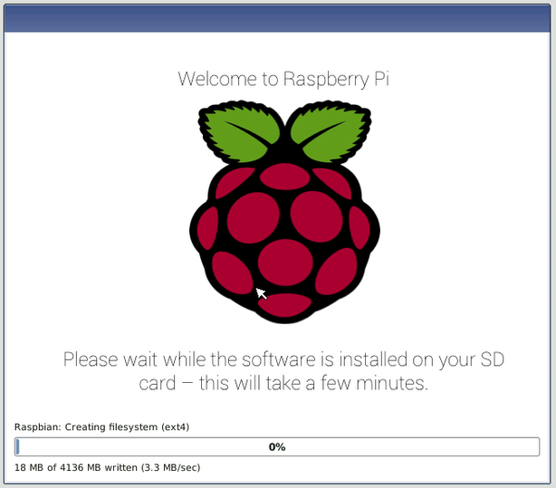

## Uruchom swoje Raspberry Pi

Twój Raspberry Pi nie ma włącznika zasilania: zaraz po podłączeniu go do gniazdka zasilania włączy się. Zwróć uwagę, że port zasilania micro USB Pi ma dłuższą płaską stronę na górze.

+ Podłącz zasilacz micro USB do gniazdka i podłącz go do portu zasilania Pi.

Powinieneś zobaczyć czerwoną diodę LED na Raspberry Pi, która wskazuje, że Pi jest podłączony do zasilania. Jak zaczyna się (nazywa się to również **uruchamiania**), widać maliny pojawiają się w górnej lewej części ekranu.

<video width="800" height="600" controls> <source src="images/piboot.webm" type="video/webm"> Twoja przeglądarka nie obsługuje wideo WebM, więc spróbuj FireFox lub Chrome. </video> 

\--- zawalić się \---

* * *

## tytuł: Pierwsze uruchomienie z NOOBS

Jeśli po raz pierwszy uruchamiasz Raspberry Pi z kartą SD zawierającą NOOBS, zobaczysz instalator NOOBS. To oprogramowanie przeprowadzi cię przez proces instalacji systemu operacyjnego Raspbian (OS).

+ Po załadowaniu instalatora, oferuje on wybór systemu operacyjnego do zainstalowania. Zaznacz pole wyboru **Raspbian**, a następnie kliknij **Zainstaluj**.

+ Kliknij **Tak** w oknie dialogowym ostrzeżenia, a następnie usiądź wygodnie i zrelaksuj się. Proces instalacji Raspbian zajmie trochę czasu.

+ Po zainstalowaniu Raspbian kliknij **OK**. Twoje Raspberry Pi uruchomi się ponownie, a Raspbian uruchomi się.

\--- /zawalić się \---

Po kilku sekundach pojawi się Pulpit Raspbian.

