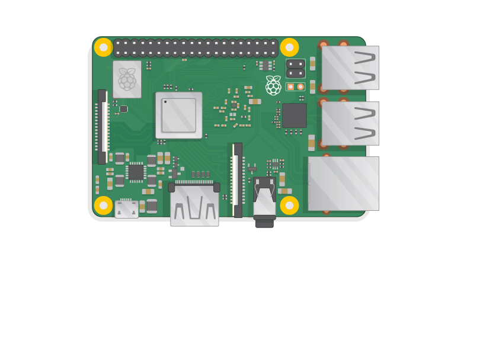

## Introdução

Aqui você aprenderá sobre o seu Raspberry Pi, as coisas que você precisa usá-lo e como configurá-lo.

Se você precisa imprimir este projeto, por favor use o [versão para impressão](https://projects.raspberrypi.org/en/projects/aspberry-pi-setting-up/print){: target = "_ blank"}.