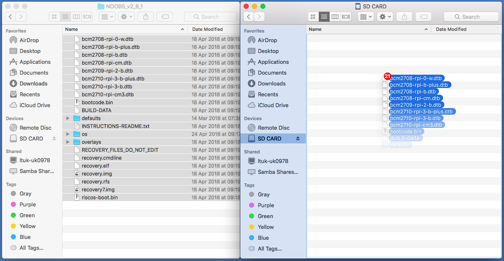

## Selecione o cartão SD

Caso o cartão SD ainda não tenha o sistema operacional Raspbian, ou se quiser reinstalar o Raspberry Pi, você poderá instalar o Raspbian facilmente. Para começar, você precisa de um computador com entrada para cartão SD - a maioria dos PCs e laptops tem essa entrada.

### O sistema operacional Raspbian via NOOBS

Usar o NOOBS é a maneira mais fácil de instalar o Raspbian no seu cartão SD.

#### Baixando o NOOBS

+ Visite [www. raspberrypi. org/downloads/](https://www.raspberrypi.org/downloads/).

+ Você vai ver uma caixa com o link para os arquivos NOOBS. Clique no link.

+ A opção mais simples é baixar o arquivo zip. Certifique-se de que lembra do local em que o arquivo foi salvo, assim você poderá encontrá-lo rapidamente.

#### Formatando o cartão SD

Qualquer coisa que esteja armazenada no cartão SD será sobrescrita durante a formatação. Portanto, se o cartão SD no qual você deseja instalar o Raspbian tiver algum arquivo, de uma versão mais antiga do Raspbian por exemplo, você pode fazer o backup desses arquivos para não perdê-los permanentemente.

+ Visite o site da SD Association e baixe [SD Formatter 4.0](https://www.sdcard.org/downloads/formatter_4/index.html) para Windows ou Mac.

+ Siga as instruções para instalar o software.

+ Insira o cartão SD no leitor de cartão SD do computador ou laptop e anote a letra da unidade alocada a ele, por exemplo, `F:/`.

+ No SD Formatter, selecione a letra da unidade do cartão SD e formate.

#### Extraindo o NOOBS do arquivo zip

Em seguida, você precisará extrair os arquivos NOOBS do arquivo zip que você baixou do site do Raspberry Pi.

+ Encontre o arquivo baixado - normalmente ele é salvo na pasta ` Downloads `.

+ Extraia os arquivos e mantenha aberta a janela do Explorer / Finder.

#### Copiando os arquivos

+ Agora abra outra janela do Explorer / Finder e navegue até o cartão SD. É melhor posicionar as duas janelas lado a lado.

+ Selecione todos os arquivos a pastao ` NOOBS ` e arraste-os para a janela do cartão SD para copiá-los para o cartão.

+ Depois que os arquivos foram copiados, você pode ejetar o cartão SD.