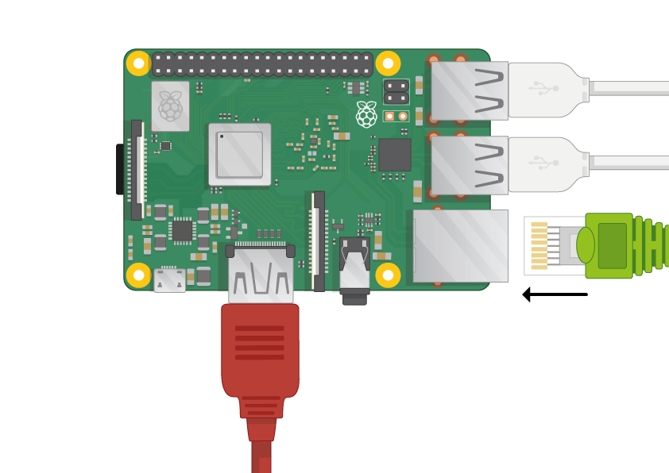

## Ligue o seu Raspberry Pi

Vamos ficar tudo conectado. É importante fazer isso na ordem correta, para que todos os seus componentes estejam seguros.

+ Insira o cartão SD que você configurou com o Raspbian (via NOOBS) no slot de cartão micro SD na parte de baixo do seu Pi. 

**Nota:** Muitos cartões micro SD virão dentro de um adaptador maior - você pode deslizar o cartão usando a borda na parte inferior.

+ Encontre o cabo USB para o mouse e conecte o mouse a uma porta USB no Raspberry Pi (não importa qual).

+ Conecte o teclado da mesma maneira.

+ Olhe para a porta HDMI no Raspberry Pi - observe que ele tem um lado grande e plano na parte superior.

+ Certifique-se de que sua tela esteja conectada a uma tomada de parede e ligada. Use um cabo para conectar a tela à porta HDMI do Pi - use um adaptador, se necessário.

**Nota:** nada será exibido na tela, porque o Pi ainda não está em execução.

+ Se você quiser conectar o Pi à internet via Ethernet, use um cabo Ethernet para conectar a porta Ethernet no Raspberry Pi a um soquete Ethernet na parede ou no seu roteador de internet. Você não precisa fazer isso se estiver usando Wi-Fi ou se não quiser se conectar à Internet.

+ O som virá da sua tela se ele tiver alto-falantes ou se você puder conectar fones de ouvido ou alto-falantes ao conector de áudio, se você os tiver.

