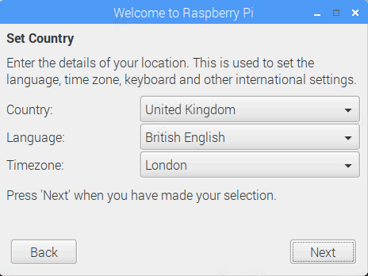

## Concluindo a configuração

Quando você iniciar o seu Raspberry Pi pela primeira vez, o aplicativo **Welcome to Raspberry Pi** irá aparecer e guiá-lo através da configuração inicial.

+ Clique em **Next** para iniciar a configuração.

+ Defina **País**, **Idioma**e **Fuso Horário**e clique novamente em **Próxima**.

+ Digite uma nova senha para o seu Raspberry Pi e clique em **Next**.

+ Conecte-se à sua rede WiFi selecionando seu nome, digitando a senha e clicando em **Próximo**.

**Nota:** se o seu modelo Raspberry Pi não tiver conectividade sem fio, você não verá esta tela.

+ Clique **Avançar** deixe o assistente verificar se há atualizações em Raspbian e instalá-las (isso pode demorar um pouco).

+ Clique em **Concluído** ou **Reiniciar** para concluir a configuração.

**Nota:** você só precisará reiniciar se necessário para concluir uma atualização.

