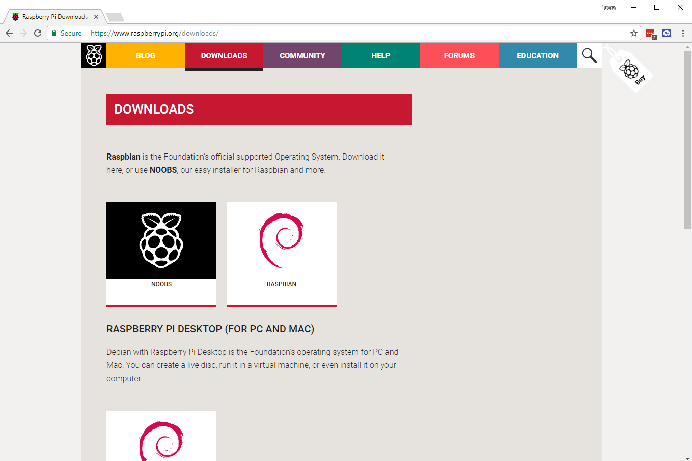

## Configure seu cartão SD

Se você tiver um cartão SD que ainda não tenha o sistema operacional Raspbian, ou se quiser redefinir seu Raspberry Pi, você poderá instalar o Raspbian facilmente. Para fazer isso, você precisa de um computador com porta de cartão SD - a maioria dos computadores de mesa e laptops tem um.

### O sistema operacional Raspbian via NOOBS

Usando o software NOOBS é a maneira mais fácil de instalar o Raspbian no seu cartão SD.

#### Baixar NOOBS

+ Visite o [Raspberry Pi downloads página](https://www.raspberrypi.org/downloads).

+ Você deve ver uma caixa ligando para os arquivos NOOBS. Clique na caixa.

+ A opção mais simples é baixar o arquivo zip dos arquivos. Certifique-se de prestar atenção em onde você salva o arquivo, para que você possa encontrá-lo novamente rapidamente.

#### Formate o cartão SD

Qualquer coisa que esteja armazenada no cartão SD será sobrescrita durante a formatação. Portanto, se o cartão SD no qual você deseja instalar o Raspbian atualmente tiver algum arquivo nele, por exemplo, de uma versão mais antiga do Raspbian, você pode querer fazer o backup desses arquivos primeiro para não perdê-los permanentemente.

+ Visite o site da SD Association e baixe [SD Formatter 4.0](https://www.sdcard.org/downloads/formatter_4/index.html) para Windows ou Mac.

+ Siga as instruções para instalar o software.

+ Insira o cartão SD no slot do cartão SD do computador ou laptop e anote a letra da unidade alocada a ele, por exemplo, `F: /`.

+ No SD Formatter, selecione a letra da unidade do cartão SD e formate o cartão.

#### Extract NOOBS from the zip archive

Next, you will need to extract the files from the NOOBS zip archive you downloaded from the Raspberry Pi website.

+ Find the downloaded archive — by default, it should be in your `Downloads` folder.

+ Double-click on it to extract the files, and keep the resulting Explorer/Finder window open.

#### Copy the files

+ Now open another Explorer/Finder window and navigate to the SD card. It's best to position the two windows side by side.

+ Select all the files in the `NOOBS` folder and drag them into the SD card window to copy them to the card.

+ Once the files have all been copied over, you can eject the SD card.