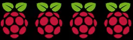

## Inicie o seu Raspberry Pi

Seu Raspberry Pi não tem um interruptor: assim que você conectá-lo a uma tomada elétrica, ele ligará. Observe que a porta de energia micro USB do Pi tem um lado plano mais longo na parte superior.

+ Conecte uma fonte de alimentação micro USB em um soquete e conecte-a à porta de energia do Pi.

Você deve ver um LED vermelho aceso no Raspberry Pi, o que indica que o Pi está conectado à energia. Ao iniciar (isso também é chamado de **boot**), você verá que as framboesas aparecem no canto superior esquerdo da tela.

<video width="800" height="600" controls> <source src="images/piboot.webm" type="video/webm"> Seu navegador não suporta vídeo WebM, por isso, experimente o FireFox ou o Chrome. </video> 

\--- colapso \---

* * *

## title: Primeira inicialização com o NOOBS

Se esta é a primeira vez que você está começando seu Raspberry Pi com um cartão SD contendo NOOBS, você verá o instalador NOOBS. Este software irá orientá-lo na instalação do sistema operacional Raspbian (OS).

+ Quando o instalador for carregado, ele oferecerá uma opção de qual sistema operacional instalar. Marque a caixa para **Raspbian**e clique em **Install**.

+ Clique em **Sim** na caixa de diálogo de advertência, depois sente-se e relaxe. O processo de instalação do Raspbian levará um pouco de tempo.

+ Quando o Raspbian tiver sido instalado, clique em **OK**. Seu Raspberry Pi será reiniciado e o Raspbian irá inicializar.

\--- / colapso \---

Após alguns segundos, o Raspbian Desktop aparecerá.

