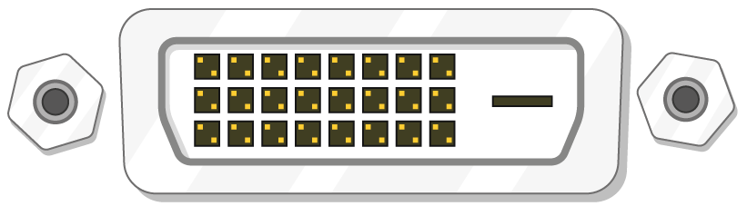

## Ce vei avea nevoie

### Care zmeura Pi?

Există mai multe modele [de Raspberry Pi](https://www.raspberrypi.org/products/), iar pentru majoritatea oamenilor, Raspberry Pi 3 Model B + este cel care va alege.

Modelul Raspberry Pi 3 Model B + este cel mai nou, cel mai rapid și mai ușor de utilizat.

Zmeura Pi Zero și Zero W sunt mai mici și necesită mai puțină putere, deci sunt utile pentru proiectele portabile, cum ar fi roboții. În general, este mai ușor să începeți un proiect cu Raspberry Pi 3 și să vă deplasați la Pi Zero atunci când aveți un prototip de lucru pe care Pi-ul mai mic va fi util.

Dacă doriți să cumpărați o piersică Pi, mergeți la [rpf.io/products](https://rpf.io/products).

### O sursă de alimentare

Pentru a vă conecta la o priză electrică, Raspberry Pi are un port micro USB (același lucru a fost găsit și pe multe telefoane mobile).

Veți avea nevoie de o sursă de alimentare care oferă cel puțin 2,5 amperi. Vă recomandăm să utilizați alimentarea oficială [Raspberry Pi](https://www.raspberrypi.org/products/raspberry-pi-universal-power-supply/).

### Un card micro SD

Raspberry Pi are nevoie de o cartelă SD pentru a stoca toate fișierele și sistemul de operare Raspbian.

Veți avea nevoie de un card micro SD cu o capacitate de cel puțin 8 GB.

Mulți vânzători furnizează cărți SD pentru Raspberry Pi, care sunt deja create cu Raspbian și sunt gata să meargă.

### O tastatură și un mouse

Pentru a începe să utilizați Zmeura dvs., veți avea nevoie de o tastatură USB și un mouse USB.

După ce ați configurat versiunea dvs. Pi, puteți utiliza o tastatură Bluetooth și un mouse, dar veți avea nevoie de o tastatură USB și de mouse pentru configurare.

### Un ecran TV sau calculator

Pentru a vizualiza mediul desktop Raspbian, veți avea nevoie de un ecran și un cablu pentru a conecta ecranul și dispozitivul Pi. Ecranul poate fi un televizor sau un monitor de computer. Dacă ecranul are difuzoare încorporate, Pi va putea să le folosească pentru a reda sunetul.

#### HDMI

Raspberry Pi are un port de ieșire HDMI care este compatibil cu portul HDMI al celor mai moderne televizoare și monitoare de calculator. Multe monitoare de calculator pot avea și porturi DVI sau VGA.

#### DVI

Dacă ecranul dvs. are un port DVI, puteți conecta dispozitivul Pi la acesta utilizând un cablu HDMI-DVI.

#### VGA

Unele ecrane au doar un port VGA.

Pentru a conecta dispozitivul Pi la un astfel de ecran, puteți utiliza un adaptor HDMI-VGA.

### Suplimente opționale

#### Un caz

S-ar putea să doriți să-i puneți pe zmeura Pi într-un caz. Acest lucru nu este esențial, dar va oferi protecție pentru dvs. Pi. Dacă doriți, aveți posibilitatea să utilizați cazul oficial pentru [Zmeura Pi 3](https://www.raspberrypi.org/products/raspberry-pi-3-case/) sau [Zero Zero sau Zero W](https://www.raspberrypi.org/products/raspberry-pi-zero-case/).

#### Căști sau difuzoare

Modelele mari de Raspberry Pi (nu Pi Zero / Zero W) au un port audio standard ca cel de pe telefonul inteligent sau MP3 player. Dacă doriți, puteți să conectați căștile sau difuzoarele astfel încât piesa Pi să poată reda sunetul. Dacă ecranul pe care îl conectați la dispozitivul dvs. Pi are difuzoare încorporate, dispozitivul Pi poate reda sunet prin intermediul acestora.

#### Un cablu Ethernet

Modelele mari de Raspberry Pi (nu Pi Zero / Zero W) au un port Ethernet standard pentru a le conecta la internet. Pentru a conecta un server Pi Zero la internet, aveți nevoie de un adaptor USB-to-Ethernet. Raspberry Pi 3 și Pi Zero W pot fi de asemenea conectate fără fir la web.