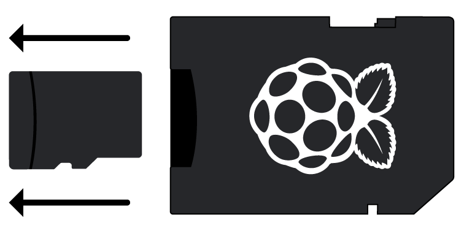

## Conectează-ți Zmeura Pi

Să facem totul conectat. Este important să faceți acest lucru în ordinea corectă, astfel încât toate componentele să fie sigure.

+ Introduceți cartela SD pe care ați configurat-o cu Raspbian (prin NOOBS) în slotul pentru cardul micro SD aflat în partea inferioară a telefonului dvs. Pi. 

**Notă:** O mulțime de carduri micro SD vor intra într-un adaptor mai mare - puteți glisa cartela folosind buza din partea inferioară.

+ Găsiți cablul USB al mouse-ului și conectați mouse-ul la un port USB de pe Raspberry Pi (nu contează pe care).

+ Conectați tastatura în același mod.

+ Uită-te la portul HDMI de pe Raspberry Pi - observați că are o latură mare, plat pe partea de sus.

+ Asigurați-vă că ecranul este conectat la o priză de perete și că este pornit. Utilizați un cablu pentru a conecta ecranul la portul HDMI al lui Pi - utilizați un adaptor, dacă este necesar.

**Notă:** nu se va afișa nimic pe ecran, deoarece Pi încă nu rulează.

+ Dacă doriți să conectați dispozitivul Pi la internet prin Ethernet, utilizați un cablu Ethernet pentru a conecta portul Ethernet de pe Raspberry Pi la o priză Ethernet de pe perete sau de pe routerul dvs. de internet. Nu aveți nevoie să faceți acest lucru dacă veți utiliza WiFi sau dacă nu doriți să vă conectați la internet.

+ Sunetul va veni de pe ecran dacă are difuzoare sau puteți conecta căști sau difuzoare la mufa audio dacă le aveți.

