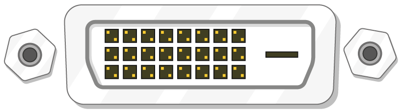

## Что тебе понадобится

### Какая именно Raspberry Pi?

Есть несколько [моделей Raspberry Pi](https://www.raspberrypi.org/products/), но большинство людей выбирает Raspberry Pi 3 Model B+.

Raspberry Pi 3 Model B+ - самая новая, самая быстрая и простая в использовании.

Raspberry Pi Zero и Zero W меньше по размеру и требуют меньшей мощности, поэтому они полезны для портативных проектов, таких как роботы. Как правило, легче начать проект с Raspberry Pi 3, а затем уже перейти к Pi Zero, когда у тебя уже есть рабочий прототип, который будет полезен для более маленькой Pi.

Если ты хочешь купить Raspberry Pi, то загляни вот сюда: [rpf.io/products](https://rpf.io/products).

### Источник питания

Для подключения к розетке питания у Raspberry Pi есть порт micro USB (такой же, как и у многих мобильных телефонов).

Тебе понадобится источник питания, который может отдавать ток не менее 2,5 ампер. Мы рекомендуем использовать [официальные источники питания Raspberry Pi](https://www.raspberrypi.org/products/raspberry-pi-universal-power-supply/).

### MicroSD карта

Для хранения всех файлов и операционной системы Raspbian твоей Raspberry Pi нужна microSD-карта.

Тебе понадобится карта microSD ёмкостью не менее 8 ГБ.

Многие продавцы поставляют microSD-карты для Raspberry Pi, которые уже содержат установленную Raspbian и готовы к работе.

### Клавиатура и мышь

Чтобы начать пользоваться твоей Raspberry, тебе понадобятся USB-клавиатура и USB-мышь.

Как только ты настроишь Pi, ты сможешь использовать клавиатуру и мышь с интерфейсом Bluetooth, но для настройки тебе понадобится USB-клавиатура и мышь.

### Экран телевизора или компьютера

Чтобы увидеть среду рабочего стола Raspbian, тебе понадобится экран и кабель для связи между экраном и Pi. В качестве экрана может быть телевизор или монитор компьютера. Если экран содержит встроенные динамики, Pi сможет использовать их для воспроизведения звука.

#### HDMI

У Raspberry Pi есть выходной порт HDMI, который совместим с портом HDMI большинства современных телевизоров и компьютерных мониторов. Многие компьютерные мониторы также могут иметь порты DVI или VGA.

#### DVI

Если у твоего экрана есть порт DVI, то с помощью кабеля HDMI-DVI ты можешь подключить Pi к нему.

#### VGA

На некоторых экранах есть только порт VGA.

Чтобы подключить Pi к такому экрану, ты можешь использовать адаптер HDMI-VGA.

### Дополнительно

#### Корпус

Ты можешь поместить свою Raspberry Pi в корпус. Это не обязательно, но это обеспечит защиту твоей Pi. Если хочешь, то ты можешь использовать официальный корпус для [Raspberry Pi 3](https://www.raspberrypi.org/products/raspberry-pi-3-case/) или [Pi Zero или Zero W](https://www.raspberrypi.org/products/raspberry-pi-zero-case/).

#### Наушники или колонки

В больших моделях Raspberry Pi (но не в Pi Zero/Zero W) есть стандартный аудио порт, такой как в твоём смартфоне или MP3-плеере. Если хочешь, то ты можешь подключить свои наушники или динамики так, чтобы Pi могла воспроизводить звук. Если на экране, к которому ты подключаешь свою Pi, есть встроенные динамики, Pi может воспроизводить звук через них.

#### Кабель Ethernet

Крупные модели Raspberry Pi (но не Pi Zero/Zero W) имеют стандартный Ethernet-порт для подключения к Интернету. Чтобы подключить Pi Zero к Интернету, вам нужен адаптер USB-to-Ethernet. Raspberry Pi 3 и Pi Zero W также могут быть подключены к беспроводной сети по беспроводной сети.