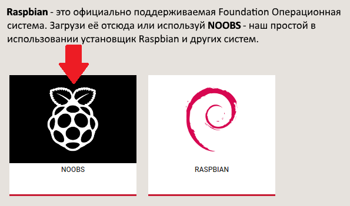

## Настройка SD-карты

Если у вас есть SD-карта, на которой еще нет операционной системы Raspbian, или если вы хотите сбросить свой малиновый Pi, вы можете легко установить Raspbian самостоятельно. Для этого вам нужен компьютер с портом SD-карты - у большинства ноутбуков и настольных компьютеров есть один.

### Операционная система Raspbian через NOOBS

Использование программного обеспечения NOOBS - это самый простой способ установки Raspbian на SD-карту.

#### Загрузить NOOBS

+ Посетите [загрузок страницу Raspberry Pi](https://www.raspberrypi.org/downloads).

+ Вы должны увидеть окно, связанное с файлами NOOBS. Нажмите на поле.

+ Самый простой вариант - загрузить zip-архив файлов. Обязательно обратите внимание на то, где вы сохраняете архив, чтобы вы могли быстро найти его.

#### Форматирование SD-карты

Все, что хранится на SD-карте, будет перезаписано во время форматирования. Поэтому, если на SD-карте, на которой вы хотите установить Raspbian, в настоящее время есть какие-либо файлы на ней, например, из старой версии Raspbian, вы можете сначала поддержать эти файлы, чтобы не потерять их навсегда.

+ Посетите веб-сайт Ассоциации SD и загрузите [SD Formatter 4.0](https://www.sdcard.org/downloads/formatter_4/index.html) для Windows или Mac.

+ Следуйте инструкциям по установке программного обеспечения.

+ Вставьте SD-карту в слот для SD-карты компьютера или ноутбука и обратите внимание на выделенную им букву диска, например `F: /`.

+ В SD Formatter выберите букву диска для SD-карты и формат карты.

#### Извлечь NOOBS из архива zip

Затем вам нужно будет извлечь файлы из ZIP-архива NOOBS, загруженного с веб-сайта Raspberry Pi.

+ Найти скачанный архив - по умолчанию он должен находиться в папке `Downloads`.

+ Дважды щелкните по нему, чтобы извлечь файлы, и сохраните открытое окно Explorer / Finder.

#### Скопируйте файлы

+ Теперь откройте другое окно Explorer / Finder и перейдите к SD-карте. Лучше всего расположить два окна бок о бок.

+ Выберите все файлы в папке `NOOBS` и перетащите их в окно SD-карты, чтобы скопировать их на карту.

+ Как только файлы будут скопированы, вы можете извлечь SD-карту.