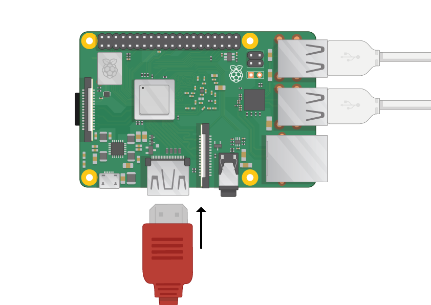

## Подключите малину Pi

Давайте все подключим. Важно сделать это в правильном порядке, чтобы все ваши компоненты были в безопасности.

+ Вставьте SD-карту, которую вы установили с помощью Raspbian (через NOOBS), в слот для карт Micro SD на нижней стороне вашего Pi. 

**Примечание:** много микро SD-карт появится внутри большего адаптера - вы можете вытащить карту с помощью губы внизу.

+ Найдите USB-кабель для мыши и подключите мышь к порту USB на малине Pi (неважно, какой из них).

+ Подключите клавиатуру таким же образом.

+ Посмотрите на порт HDMI на малине Pi - обратите внимание, что он имеет большую плоскую сторону сверху.

+ Убедитесь, что ваш экран подключен к розетке и включен. Используйте кабель для подключения экрана к порту HDMI Pi - при необходимости используйте адаптер.

**Примечание:** ничего не будет отображаться на экране, потому что Pi еще не запущен.

+ Если вы хотите подключить Pi к Интернету через Ethernet, используйте Ethernet-кабель для подключения Ethernet-порта на Raspberry Pi к разъему Ethernet на стене или на вашем интернет-маршрутизаторе. Вам не нужно это делать, если вы будете использовать Wi-Fi или если вы не хотите подключаться к Интернету.

+ Звук будет выводиться с вашего экрана, если у него есть динамики, или вы можете подключить наушники или динамики к аудиоразъему, если они у вас есть.

