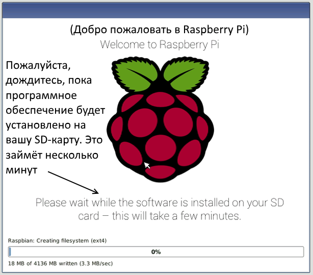

## Запустите свой малиновый пи

У вашей малины Pi нет переключателя питания: как только вы подключите его к розетке, он включится. Обратите внимание, что порт питания Micro USB Pi имеет более длинную плоскую сторону сверху.

+ Подключите источник питания micro USB в гнездо и подключите его к порту питания Pi.

Вы должны увидеть красный светодиод на малине Pi, что указывает на то, что Pi подключен к электросети. Как запускается (это также называется **загрузкой**), вы увидите , малина появится в верхнем левом углу экрана.

<video width="800" height="600" controls> <source src="images/piboot.webm" type="video/webm"> Ваш браузер не поддерживает видео WebM, поэтому попробуйте FireFox или Chrome. </video> 

\--- коллапс \---

* * *

## название: первый запуск с NOOBS

Если вы впервые запускаете свой малиновый Pi с SD-картой, содержащей NOOBS, вы увидите установщик NOOBS. Это программное обеспечение проведет вас через установку операционной системы Raspbian (ОС).

+ Когда установщик загрузится, он предложит вам выбрать, какую ОС установить. Установите флажок для **Raspbian**, а затем нажмите кнопку **Установить**.

+ Нажмите **Да** в диалоговом окне предупреждения, а затем расслабьтесь и расслабьтесь. Процесс установки Raspbian займет немного времени.

+ Когда Raspbian установлен, нажмите **OK**. Ваш Raspberry Pi перезагрузится, и Raspbian загрузится.

\--- / свернуть \---

Через несколько секунд появится рабочий стол Raspbian.

