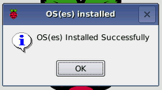

## Spustite svoj Malinový pi

Vaša Raspberry Pi nemá vypínač: akonáhle ho pripájate do elektrickej zásuvky, zapne sa. Všimnite si, že napájací port Micro pre USB má dlhšiu rovnú stranu na vrchu.

+ Pripojte napájanie micro USB do zásuvky a pripojte ho k portu napájania Pi.

Mali by ste vidieť červenú LED svietiť na Raspberry Pi, čo znamená, že Pi je pripojený k napájaniu. Keď sa spúšťa (toto sa tiež nazýva **bootovanie**), uvidíte maliny v ľavom hornom rohu obrazovky.

<video width="800" height="600" controls> <source src="images/piboot.webm" type="video/webm"> Váš prehliadač nepodporuje video WebM, preto skúste FireFox alebo Chrome. </video> 

\--- collapse \---

* * *

## názov: Prvé spustenie s NOOBS

Ak sa jedná o prvýkrát, keď začnete svoju Raspberry Pi so SD kartou obsahujúcou NOOBS, uvidíte inštalačný program NOOBS. Tento softvér vás prevedie inštaláciou operačného systému Raspbian (OS).

+ Po nainštalovaní inštalátora vám ponúkne možnosť vybrať si, ktorý operačný systém nainštalujete. Začiarknite políčko **Raspbian**a potom kliknite na **Install**.

+ Kliknite **Áno** v dialógovom okne upozornenie, a potom sedieť a relaxovať. Inštalačný proces Raspbian bude trvať trochu času.

+ Keď bol Raspbian nainštalovaný, kliknite na **OK**. Vaša Raspberry Pi sa reštartuje a Raspbian sa potom rozbehne.

\--- / collapse \---

Po niekoľkých sekundách sa zobrazí Raspbian Desktop.

